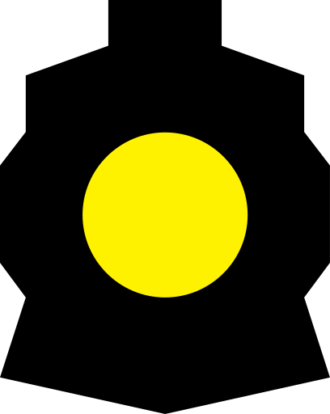
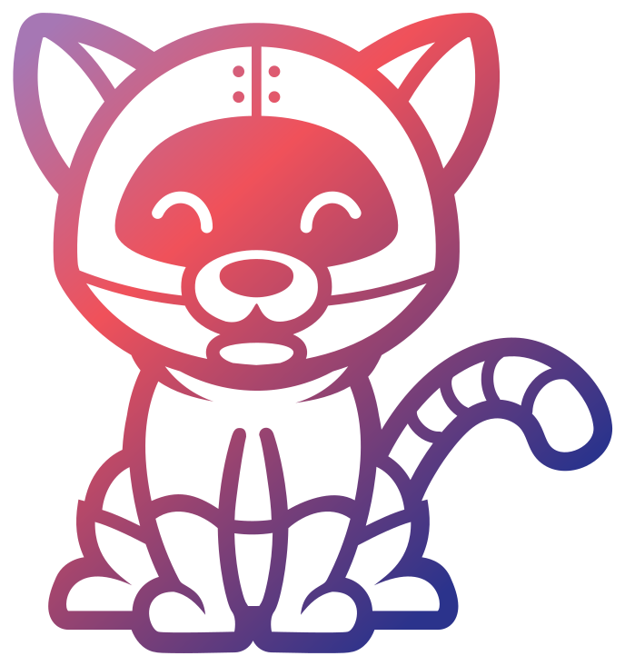
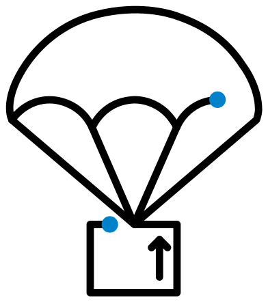

# Koda Reef

Security research and contributions to open-source software.

<kbd><a href="#project-activepieces-activepieces">&nbsp;Activepieces</a></kbd>
<kbd><a href="#project-apache-httpd">&nbsp;Apache&nbsp;HTTP&nbsp;Server</a></kbd>
<kbd><a href="#project-withastro-astro">&nbsp;Astro</a></kbd>
<kbd><a href="#project-goauthentik-authentik">&nbsp;authentik</a></kbd>
<kbd><a href="#project-authorizerdev-authorizer">&nbsp;Authorizer</a></kbd>
<kbd><a href="#project-wwbn-avideo">AVideo</a></kbd>
<kbd><a href="#project-bentoml-bentoml"><picture><source media="(prefers-color-scheme: dark)" srcset="./assets/logos/bentoml-bentoml-dark.png"></picture>&nbsp;BentoML</a></kbd>
<kbd><a href="#project-henrygd-beszel">&nbsp;Beszel</a></kbd>
<kbd><a href="#project-richlegrand-bitbang-cli">bitbang&#8209;cli</a></kbd>
<kbd><a href="#project-richlegrand-bitbang-server">bitbang&#8209;server</a></kbd>
<kbd><a href="#project-c-ares-c-ares">&nbsp;c&#8209;ares</a></kbd>
<kbd><a href="#project-cilium-cilium">&nbsp;Cilium</a></kbd>
<kbd><a href="#project-cloudnative-pg-cloudnative-pg">&nbsp;CloudNativePG</a></kbd>
<kbd><a href="#project-comfy-org-comfyui">&nbsp;ComfyUI</a></kbd>
<kbd><a href="#project-composer-composer">&nbsp;Composer</a></kbd>
<kbd><a href="#project-projectcontour-contour">&nbsp;Contour</a></kbd>
<kbd><a href="#project-coollabsio-coolify">&nbsp;Coolify</a></kbd>
<kbd><a href="#project-sigstore-cosign">&nbsp;Cosign</a></kbd>
<kbd><a href="#project-dgraph-io-dgraph"><picture><source media="(prefers-color-scheme: dark)" srcset="./assets/logos/dgraph-io-dgraph-dark.png"></picture>&nbsp;Dgraph</a></kbd>
<kbd><a href="#project-cure53-dompurify">DOMPurify</a></kbd>
<kbd><a href="#project-envoyproxy-envoy">&nbsp;Envoy</a></kbd>
<kbd><a href="#project-external-secrets-external-secrets">&nbsp;External&nbsp;Secrets</a></kbd>
<kbd><a href="#project-filebrowser-filebrowser">&nbsp;File&nbsp;Browser</a></kbd>
<kbd><a href="#project-rancher-fleet">&nbsp;Fleet</a></kbd>
<kbd><a href="#project-flowiseai-flowise">&nbsp;Flowise</a></kbd>
<kbd><a href="#project-freescout-help-desk-freescout">&nbsp;FreeScout</a></kbd>
<kbd><a href="#project-giskard-ai-giskard-oss">&nbsp;Giskard</a></kbd>
<kbd><a href="#project-gitoxidelabs-gitoxide">gitoxide</a></kbd>
<kbd><a href="#project-gnome-glib">GNOME&nbsp;GLib</a></kbd>
<kbd><a href="#project-go-git-go-git">go&#8209;git</a></kbd>
<kbd><a href="#project-in-toto-go-witness">go&#8209;witness</a></kbd>
<kbd><a href="#project-russellhaering-gosaml2">gosaml2</a></kbd>
<kbd><a href="#project-gotenberg-gotenberg">&nbsp;Gotenberg</a></kbd>
<kbd><a href="#project-kubernetes-sigs-headlamp">&nbsp;Headlamp</a></kbd>
<kbd><a href="#project-kjur-jsrsasign">jsrsasign</a></kbd>
<kbd><a href="#project-kata-containers-kata-containers">&nbsp;Kata&nbsp;Containers</a></kbd>
<kbd><a href="#project-1panel-dev-kubepi">&nbsp;KubePi</a></kbd>
<kbd><a href="#project-libevent-libevent">libevent</a></kbd>
<kbd><a href="#project-strukturag-libheif">libheif</a></kbd>
<kbd><a href="#project-libjpeg-turbo-libjpeg-turbo">libjpeg&#8209;turbo</a></kbd>
<kbd><a href="#project-nih-at-libzip">libzip</a></kbd>
<kbd><a href="#project-lighttpd-lighttpd1-4">lighttpd</a></kbd>
<kbd><a href="#project-nangohq-nango">&nbsp;Nango</a></kbd>
<kbd><a href="#project-nats-io-nats-server">&nbsp;NATS&nbsp;Server</a></kbd>
<kbd><a href="#project-nginx-nginx">&nbsp;NGINX</a></kbd>
<kbd><a href="#project-nginx-kubernetes-ingress">&nbsp;NGINX&nbsp;Ingress&nbsp;Controller</a></kbd>
<kbd><a href="#project-novuhq-novu">&nbsp;Novu</a></kbd>
<kbd><a href="#project-oauth2-proxy-oauth2-proxy">&nbsp;OAuth2&nbsp;Proxy</a></kbd>
<kbd><a href="#project-oneuptime-oneuptime">&nbsp;OneUptime</a></kbd>
<kbd><a href="#project-open-telemetry-opentelemetry-collector-contrib">&nbsp;OpenTelemetry&nbsp;Collector</a></kbd>
<kbd><a href="#project-open-telemetry-opentelemetry-go">&nbsp;OpenTelemetry&nbsp;Go</a></kbd>
<kbd><a href="#project-phpseclib-phpseclib">phpseclib</a></kbd>
<kbd><a href="#project-pocket-id-pocket-id">&nbsp;Pocket&nbsp;ID</a></kbd>
<kbd><a href="#project-python-poetry-poetry">&nbsp;Poetry</a></kbd>
<kbd><a href="#project-prefecthq-prefect">&nbsp;Prefect</a></kbd>
<kbd><a href="#project-bufbuild-protoc-gen-validate">&nbsp;protoc&#8209;gen&#8209;validate</a></kbd>
<kbd><a href="#project-pyload-pyload">&nbsp;pyLoad</a></kbd>
<kbd><a href="#project-py-pdf-pypdf">pypdf</a></kbd>
<kbd><a href="#project-rustfs-rustfs">RustFS</a></kbd>
<kbd><a href="#project-steveukx-git-js">simple&#8209;git</a></kbd>
<kbd><a href="#project-siyuan-note-siyuan">&nbsp;SiYuan</a></kbd>
<kbd><a href="#project-charmbracelet-soft-serve">Soft&nbsp;Serve</a></kbd>
<kbd><a href="#project-nasa-spacewasm">&nbsp;SpaceWasm&nbsp;(NASA)</a></kbd>
<kbd><a href="#project-stablelib-stablelib">StableLib</a></kbd>
<kbd><a href="#project-statamic-cms">&nbsp;Statamic</a></kbd>
<kbd><a href="#project-systemd-systemd">&nbsp;systemd</a></kbd>
<kbd><a href="#project-tektoncd-pipeline">&nbsp;Tekton&nbsp;Pipelines</a></kbd>
<kbd><a href="#project-traefik-traefik">&nbsp;Traefik</a></kbd>
<kbd><a href="#project-theupdateframework-python-tuf"><picture><source media="(prefers-color-scheme: dark)" srcset="./assets/logos/theupdateframework-python-tuf-dark.svg"></picture>&nbsp;TUF&nbsp;(Python)</a></kbd>
<kbd><a href="#project-vim-vim">&nbsp;Vim</a></kbd>
<kbd><a href="#project-wekan-wekan">&nbsp;Wekan</a></kbd>
<kbd><a href="#project-in-toto-witness">&nbsp;witness</a></kbd>
<kbd><a href="#project-zitadel-zitadel">&nbsp;ZITADEL</a></kbd>

73 projects · 70 published advisories · 12 merged patches

## Work by project

Alphabetical by project; newest work first within each.

###  [Activepieces](https://github.com/activepieces/activepieces)

**[CVE-2026-73081](https://www.cve.org/CVERecord?id=CVE-2026-73081)** · [GHSA-3pfv-m69p-5fv5](https://github.com/activepieces/activepieces/security/advisories/GHSA-3pfv-m69p-5fv5) 🟠 High · 2026-07-17

A flow Code step’s name reached a shell-invoked bun build command without sufficient validation. An authenticated user able to create a flow could execute commands as the worker user before sandboxing began.

Versions, credits, and sources

#### GHSA-3pfv-m69p-5fv5

[Maintainer advisory](https://github.com/activepieces/activepieces/security/advisories/GHSA-3pfv-m69p-5fv5) · Published 2026-07-17 · Checked 2026-09-06

Maintainer severity: 🟠 High. Maintainer: CVSS 4.0 **8.7**.

Not found in GitHub’s global advisory database at the 2026-09-06 lookup.

Contributors: [p80n-sec](https://github.com/p80n-sec) (reporter), [kodareef5](https://github.com/kodareef5) (reporter), [Aviral2642](https://github.com/Aviral2642) (reporter).

**Maintainer package records**

| Package | Affected | Fixed |
|---|---|---|
| activepieces | &lt;= 0.79.4 | 0.80.0 |

[CVE-2026-73081](https://www.cve.org/CVERecord?id=CVE-2026-73081)

[CVE CNA source](https://raw.githubusercontent.com/CVEProject/cvelistV5/main/cves/2026/73xxx/CVE-2026-73081.json)

CVE CNA: CVSS 4.0 **8.7**.
CNA version record — activepieces: affected: &lt; 0.80.0.

**Coverage:** [HackerNoon · Aviral Srivastava](https://hackernoon.com/breaking-down-three-activepieces-vulnerabilities-in-code-execution-pipelines).

###  [Apache HTTP Server](https://github.com/apache/httpd)

**[Merged patch](https://github.com/apache/httpd/commit/d11e440)** · 2026-04-16 (committed) — Integer overflow guards in four core escaping functions

Credit and sources

**[Merged patch](https://github.com/apache/httpd/commit/d11e440):** Submitted by: Koda Reef. Checked 2026-09-06.

###  [Astro](https://github.com/withastro/astro)

**[CVE-2026-41321](https://www.cve.org/CVERecord?id=CVE-2026-41321)** · [GHSA-88gm-j2wx-58h6](https://github.com/withastro/astro/security/advisories/GHSA-88gm-j2wx-58h6) 🔵 Low · 2026-04-20

The Cloudflare image-binding transform checked only the initial remote-image URL and followed redirects. An open redirect on an allowed domain could bypass image-domain restrictions and trigger blind requests to destinations outside that allowlist.

Versions, credits, and sources

#### GHSA-88gm-j2wx-58h6

[Maintainer advisory](https://github.com/withastro/astro/security/advisories/GHSA-88gm-j2wx-58h6) · Published 2026-04-20 · Checked 2026-09-06

Maintainer severity: 🔵 Low. Maintainer: CVSS 3.1 **2.2**.

[GitHub global record](https://github.com/advisories/GHSA-88gm-j2wx-58h6) · Indexed 2026-04-23.

Global severity: 🔵 Low. GitHub global: CVSS 4.0 **0.0**; CVSS 3.1 **2.2**.

Contributors: [kodareef5](https://github.com/kodareef5) (reporter).

Maintainer weaknesses: [CWE-918](https://cwe.mitre.org/data/definitions/918.html).

**Maintainer package records**

| Package | Affected | Fixed |
|---|---|---|
| @astrojs/cloudflare | &lt;= 13.1.6 | 13.1.10 |

**GitHub global package records**

| Package | Affected | Fixed |
|---|---|---|
| @astrojs/cloudflare | &lt; 13.1.10 | 13.1.10 |

[CVE-2026-41321](https://www.cve.org/CVERecord?id=CVE-2026-41321)

[CVE CNA source](https://raw.githubusercontent.com/CVEProject/cvelistV5/main/cves/2026/41xxx/CVE-2026-41321.json)

CVE CNA: CVSS 3.1 **2.2**.
CNA version record — @astrojs/cloudflare: affected: &lt; 13.1.10.

[NVD record](https://nvd.nist.gov/vuln/detail/CVE-2026-41321)

**Incomplete fix:** [GHSA-qpr4-c339-7vq8](https://github.com/withastro/astro/security/advisories/GHSA-qpr4-c339-7vq8). Redirect controls added to other image paths were absent from the Cloudflare image-binding transform.

###  [authentik](https://github.com/goauthentik/authentik)

**[CVE-2026-41577](https://www.cve.org/CVERecord?id=CVE-2026-41577)** · [GHSA-4v4x-x5pr-8gp2](https://github.com/goauthentik/authentik/security/advisories/GHSA-4v4x-x5pr-8gp2) 🟡 Moderate · 2026-05-12

SAML assertion processing omitted time and audience conditions. An attacker holding a valid signed assertion could replay it after its signed expiry or use an assertion issued for a different service provider.

**[Vendor acknowledgement](https://docs.goauthentik.io/security/cves/CVE-2026-40165)** — SAML NameID truncation in CVE-2026-40165

Versions, credits, and sources

#### GHSA-4v4x-x5pr-8gp2

[Maintainer advisory](https://github.com/goauthentik/authentik/security/advisories/GHSA-4v4x-x5pr-8gp2) · Published 2026-05-12 · Checked 2026-09-06

Maintainer severity: 🟡 Moderate. Maintainer: no structured CVSS score.

Not found in GitHub’s global advisory database at the 2026-09-06 lookup.

Contributors: [kodareef5](https://github.com/kodareef5) (reporter), [Android-Login-Analysis](https://github.com/Android-Login-Analysis) (reporter), [AyushParkara](https://github.com/AyushParkara) (reporter).

Maintainer weaknesses: [CWE-345](https://cwe.mitre.org/data/definitions/345.html).

**Maintainer package records**

| Package | Affected | Fixed |
|---|---|---|
| authentik | &lt;= 2025.2.4 | Not specified |

[CVE-2026-41577](https://www.cve.org/CVERecord?id=CVE-2026-41577)

[CVE CNA source](https://raw.githubusercontent.com/CVEProject/cvelistV5/main/cves/2026/41xxx/CVE-2026-41577.json)

CVE CNA: CVSS 4.0 **6.9**.
CNA version record — authentik: affected: &lt; 2025.12.5; affected: &lt; 2026.2.3.

**[Vendor acknowledgement](https://docs.goauthentik.io/security/cves/CVE-2026-40165):** Named on the vendor CVE page. Checked 2026-09-06.

###  [Authorizer](https://github.com/authorizerdev/authorizer)

**[CVE-2026-35511](https://www.cve.org/CVERecord?id=CVE-2026-35511)** · [GHSA-29rf-f4vv-pvq6](https://github.com/authorizerdev/authorizer/security/advisories/GHSA-29rf-f4vv-pvq6) 🔴 Critical · 2026-08-13

OAuth login linked accounts by email without requiring the existing account to verify that address. An attacker who registered a victim’s email retained password access when the victim later signed in through an OAuth provider.

[GHSA-x3f4-v83f-7wp2](https://github.com/authorizerdev/authorizer/security/advisories/GHSA-x3f4-v83f-7wp2) 🟠 High · 2026-04-03

Several authentication endpoints attached tokens to caller-supplied redirect URLs without checking AllowedOrigins. An attacker could capture reset, magic-link, or authentication tokens after the victim followed an emailed link leading through the affected flow.

Versions, credits, and sources

#### GHSA-29rf-f4vv-pvq6

[Maintainer advisory](https://github.com/authorizerdev/authorizer/security/advisories/GHSA-29rf-f4vv-pvq6) · Published 2026-08-13 · Checked 2026-09-06

Maintainer severity: 🔴 Critical. Maintainer: no structured CVSS score.

[GitHub global record](https://github.com/advisories/GHSA-29rf-f4vv-pvq6) · Indexed 2026-08-14.

Global severity: 🟠 High. GitHub global: CVSS 4.0 **8.7**; CVSS 3.x **0.0**.

The maintainer and global severity labels differ; this page uses the maintainer’s label.

Contributors: [kodareef5](https://github.com/kodareef5) (reporter).

Maintainer weaknesses: [CWE-287](https://cwe.mitre.org/data/definitions/287.html).

**Maintainer package records**

| Package | Affected | Fixed |
|---|---|---|
| github.com/authorizerdev/authorizer | &lt; 2.4.0-rc.16 | 2.4.0-rc.16 |

**GitHub global package records**

| Package | Affected | Fixed |
|---|---|---|
| github.com/authorizerdev/authorizer | &lt; 0.0.0-20260807033110-66fe488fd2a4 | 0.0.0-20260807033110-66fe488fd2a4 |

[CVE-2026-35511](https://www.cve.org/CVERecord?id=CVE-2026-35511)

Verification note: the advisory supplies this CVE identifier, but its public CVE JSON was not retrievable at the 2026-09-06 check.

#### GHSA-x3f4-v83f-7wp2

[Maintainer advisory](https://github.com/authorizerdev/authorizer/security/advisories/GHSA-x3f4-v83f-7wp2) · Published 2026-04-03 · Checked 2026-09-06

Maintainer severity: 🟠 High. Maintainer: no structured CVSS score.

[GitHub global record](https://github.com/advisories/GHSA-x3f4-v83f-7wp2) · Indexed 2026-04-06.

Global severity: 🟠 High. GitHub global: CVSS 4.0 **8.6**; CVSS 3.x **0.0**.

Contributors: [kodareef5](https://github.com/kodareef5) (reporter).

Maintainer weaknesses: [CWE-601](https://cwe.mitre.org/data/definitions/601.html).

**Maintainer package records**

| Package | Affected | Fixed |
|---|---|---|
| github.com/authorizerdev/authorizer | &lt;= 2.0.0 | Not specified |

**GitHub global package records**

| Package | Affected | Fixed |
|---|---|---|
| github.com/authorizerdev/authorizer | &lt; 0.0.0-20260329085140-6d9bef1aaba3 | 0.0.0-20260329085140-6d9bef1aaba3 |

### [AVideo](https://github.com/WWBN/AVideo)

**[CVE-2026-33766](https://www.cve.org/CVERecord?id=CVE-2026-33766)** · [GHSA-f359-r3pv-2phf](https://github.com/WWBN/AVideo/security/advisories/GHSA-f359-r3pv-2phf) 🟡 Moderate · 2026-03-24

Image-download endpoints validated the starting URL but followed HTTP redirects without checking their destinations. A user with upload and edit permissions could redirect the server to internal services or reachable cloud metadata endpoints.

Versions, credits, and sources

#### GHSA-f359-r3pv-2phf

[Maintainer advisory](https://github.com/WWBN/AVideo/security/advisories/GHSA-f359-r3pv-2phf) · Published 2026-03-24 · Checked 2026-09-06

Maintainer severity: 🟡 Moderate. Maintainer: no structured CVSS score.

[GitHub global record](https://github.com/advisories/GHSA-f359-r3pv-2phf) · Indexed 2026-03-26.

Global severity: 🟡 Moderate. GitHub global: CVSS 4.0 **5.3**; CVSS 3.x **0.0**.

Contributors: [kodareef5](https://github.com/kodareef5) (reporter).

Maintainer weaknesses: [CWE-918](https://cwe.mitre.org/data/definitions/918.html).

**Maintainer package records**

| Package | Affected | Fixed |
|---|---|---|
| wwbn/avideo | &lt;= 14.3 | Not specified |

**GitHub global package records**

| Package | Affected | Fixed |
|---|---|---|
| wwbn/avideo | &lt;= 26.0 | Not specified |

[CVE-2026-33766](https://www.cve.org/CVERecord?id=CVE-2026-33766)

[CVE CNA source](https://raw.githubusercontent.com/CVEProject/cvelistV5/main/cves/2026/33xxx/CVE-2026-33766.json)

CVE CNA: CVSS 4.0 **5.3**.
CNA version record — AVideo: affected: &lt;= 26.0.

[NVD record](https://nvd.nist.gov/vuln/detail/CVE-2026-33766)

### <picture><source media="(prefers-color-scheme: dark)" srcset="./assets/logos/bentoml-bentoml-dark.png"></picture> [BentoML](https://github.com/bentoml/BentoML)

**[CVE-2026-35043](https://www.cve.org/CVERecord?id=CVE-2026-35043)** · [GHSA-fgv4-6jr3-jgfw](https://github.com/bentoml/BentoML/security/advisories/GHSA-fgv4-6jr3-jgfw) 🔴 Critical · 2026-04-02

Cloud deployment script generation inserted system\_packages from bentofile.yaml into a shell command without quoting. An attacker-controlled package entry could execute commands during the BentoCloud build; an earlier local-path quoting fix missed this cloud-specific path.

Versions, credits, and sources

#### GHSA-fgv4-6jr3-jgfw

[Maintainer advisory](https://github.com/bentoml/BentoML/security/advisories/GHSA-fgv4-6jr3-jgfw) · Published 2026-04-02 · Checked 2026-09-06

Maintainer severity: 🔴 Critical. Maintainer: no structured CVSS score.

[GitHub global record](https://github.com/advisories/GHSA-fgv4-6jr3-jgfw) · Indexed 2026-04-03.

Global severity: 🟠 High. GitHub global: CVSS 4.0 **0.0**; CVSS 3.1 **7.8**.

The maintainer and global severity labels differ; this page uses the maintainer’s label.

Contributors: [kodareef5](https://github.com/kodareef5) (reporter).

Maintainer weaknesses: [CWE-78](https://cwe.mitre.org/data/definitions/78.html).

**Maintainer package records**

| Package | Affected | Fixed |
|---|---|---|
| bentoml | &lt;= 1.4.37 | 1.4.38 |

**GitHub global package records**

| Package | Affected | Fixed |
|---|---|---|
| bentoml | &lt;= 1.4.37 | 1.4.38 |

[CVE-2026-35043](https://www.cve.org/CVERecord?id=CVE-2026-35043)

[CVE CNA source](https://raw.githubusercontent.com/CVEProject/cvelistV5/main/cves/2026/35xxx/CVE-2026-35043.json)

CVE CNA: CVSS 3.1 **7.8**.
CNA version record — BentoML: affected: &lt; 1.4.38.

[NVD record](https://nvd.nist.gov/vuln/detail/CVE-2026-35043)

**Incomplete fix:** [commit ce53491](https://github.com/bentoml/BentoML/commit/ce53491). The earlier quoting fix did not cover the cloud deployment setup script.

###  [Beszel](https://github.com/henrygd/beszel)

**[CVE-2026-40077](https://www.cve.org/CVERecord?id=CVE-2026-40077)** · [GHSA-5f5r-95pg-xrpm](https://github.com/henrygd/beszel/security/advisories/GHSA-5f5r-95pg-xrpm) 🔵 Low · 2026-04-09

Several hub endpoints checked authentication but not membership of the requested system. Cross-system container access required both a valid 15-character system ID and 12-character container ID; other affected endpoints could disclose system information or trigger SMART refreshes.

Versions, credits, and sources

#### GHSA-5f5r-95pg-xrpm

[Maintainer advisory](https://github.com/henrygd/beszel/security/advisories/GHSA-5f5r-95pg-xrpm) · Published 2026-04-09 · Checked 2026-09-06

Maintainer severity: 🔵 Low. Maintainer: CVSS 3.1 **3.5**.

[GitHub global record](https://github.com/advisories/GHSA-5f5r-95pg-xrpm) · Indexed 2026-04-10.

Global severity: 🔵 Low. GitHub global: CVSS 4.0 **0.0**; CVSS 3.1 **3.5**.

Contributors: [marduc812](https://github.com/marduc812) (reporter), [kodareef5](https://github.com/kodareef5) (reporter), [lakshayyverma](https://github.com/lakshayyverma) (reporter).

Maintainer weaknesses: [CWE-184](https://cwe.mitre.org/data/definitions/184.html).

**Maintainer package records**

| Package | Affected | Fixed |
|---|---|---|
|  github.com/henrygd/beszel | &lt;= 0.18.6 | &gt;= 0.18.7 |

**GitHub global package records**

| Package | Affected | Fixed |
|---|---|---|
| github.com/henrygd/beszel | &lt;= 0.18.6 | 0.18.7 |

[CVE-2026-40077](https://www.cve.org/CVERecord?id=CVE-2026-40077)

[CVE CNA source](https://raw.githubusercontent.com/CVEProject/cvelistV5/main/cves/2026/40xxx/CVE-2026-40077.json)

CVE CNA: CVSS 3.1 **3.5**.
CNA version record — beszel: affected: &lt; 0.18.7.

[NVD record](https://nvd.nist.gov/vuln/detail/CVE-2026-40077)

### [bitbang-cli](https://github.com/richlegrand/bitbang-cli)

**[Merged patch](https://github.com/richlegrand/bitbang-cli/pull/12)** · 2026-08-16 (merged) — Publish a running tmux session as a shareable URL

**[Merged patch](https://github.com/richlegrand/bitbang-cli/pull/10)** · 2026-08-01 (merged) — Reachable dnsmessage panic in mDNS response parsing (GO-2026-5942); golang.org/x/net bumped to v0.57.0

Credit and sources

**[Merged patch](https://github.com/richlegrand/bitbang-cli/pull/12):** PR authored by kodareef5 and merged. Checked 2026-09-06.

Ordinary open-source contribution.

**[Merged patch](https://github.com/richlegrand/bitbang-cli/pull/10):** PR merged. Checked 2026-09-06.

### [bitbang-server](https://github.com/richlegrand/bitbang-server)

**[Merged patch](https://github.com/richlegrand/bitbang-server/pull/2)** · 2026-08-15 (merged) — Add bitbang-metrics-dump and a build/test CI workflow

Credit and sources

**[Merged patch](https://github.com/richlegrand/bitbang-server/pull/2):** PR authored by kodareef5 and merged. Checked 2026-09-06.

Ordinary open-source contribution.

###  [c-ares](https://github.com/c-ares/c-ares)

**[Merged patch](https://github.com/c-ares/c-ares/pull/1094)** · 2026-03-22 (merged) — Overflow checks in <code>ares_buf_ensure_space()</code>

Credit and sources

**[Merged patch](https://github.com/c-ares/c-ares/pull/1094):** PR merged. Checked 2026-09-06.

Sources: [Node.js release notes](https://github.com/nodejs/node/blob/main/deps/cares/RELEASE-NOTES.md).

###  [Cilium](https://github.com/cilium/cilium)

**[CVE-2026-41520](https://www.cve.org/CVERecord?id=CVE-2026-41520)** · [GHSA-gj49-89wh-h4gj](https://github.com/cilium/cilium/security/advisories/GHSA-gj49-89wh-h4gj) 🟠 High · 2026-04-22

Debug archives from WireGuard-enabled Cilium nodes included the node’s WireGuard private key. Anyone receiving an affected bugtool archive or sysdump obtained that key; remediation required rotating keys already shared in diagnostic bundles.

Versions, credits, and sources

#### GHSA-gj49-89wh-h4gj

[Maintainer advisory](https://github.com/cilium/cilium/security/advisories/GHSA-gj49-89wh-h4gj) · Published 2026-04-22 · Checked 2026-09-06

Maintainer severity: 🟠 High. Maintainer: CVSS 3.1 **7.9**.

[GitHub global record](https://github.com/advisories/GHSA-gj49-89wh-h4gj) · Indexed 2026-04-25.

Global severity: 🟠 High. GitHub global: CVSS 4.0 **0.0**; CVSS 3.1 **7.9**.

Contributors: [tklauser](https://github.com/tklauser) (remediation developer), [kodareef5](https://github.com/kodareef5) (reporter).

Maintainer weaknesses: [CWE-200](https://cwe.mitre.org/data/definitions/200.html), [CWE-312](https://cwe.mitre.org/data/definitions/312.html).

**Maintainer package records**

| Package | Affected | Fixed |
|---|---|---|
| cilium-bugtool | &lt; 1.17.15  | 1.17.15 |
| cilium-bugtool | &gt;= 1.18.0, &lt; 1.18.9 | 1.18.9 |
| cilium-bugtool |  &gt;= 1.19.0, &lt; 1.19.3 | 1.19.3 |

**GitHub global package records**

| Package | Affected | Fixed |
|---|---|---|
| github.com/cilium/cilium | &lt; 1.17.15 | 1.17.15 |
| github.com/cilium/cilium | &gt;= 1.18.0, &lt; 1.18.9 | 1.18.9 |
| github.com/cilium/cilium | &gt;= 1.19.0, &lt; 1.19.3 | 1.19.3 |

[CVE-2026-41520](https://www.cve.org/CVERecord?id=CVE-2026-41520)

[CVE CNA source](https://raw.githubusercontent.com/CVEProject/cvelistV5/main/cves/2026/41xxx/CVE-2026-41520.json)

CVE CNA: CVSS 3.1 **7.9**.
CNA version record — cilium: affected: &lt; 1.17.15; affected: &gt;= 1.18.0, &lt; 1.18.9; affected: &gt;= 1.19.0, &lt; 1.19.3.

[NVD record](https://nvd.nist.gov/vuln/detail/CVE-2026-41520)

###  [CloudNativePG](https://github.com/cloudnative-pg/cloudnative-pg)

**[Upstream acknowledgement](https://github.com/cloudnative-pg/cloudnative-pg/commit/caf2077)** · 2026-05-07 (committed) — Recovery target validation

**[Upstream acknowledgement](https://github.com/cloudnative-pg/cloudnative-pg/commit/d65da47)** · 2026-04-29 (committed) — Escaping in PostgreSQL configuration values

Credit and sources

**[Upstream acknowledgement](https://github.com/cloudnative-pg/cloudnative-pg/commit/caf2077):** Suggested-by: Koda Reef. Checked 2026-09-06.

**[Upstream acknowledgement](https://github.com/cloudnative-pg/cloudnative-pg/commit/d65da47):** Reported-by: Koda Reef. Checked 2026-09-06.

###  [ComfyUI](https://github.com/Comfy-Org/ComfyUI)

**[CVE-2026-56671](https://www.cve.org/CVERecord?id=CVE-2026-56671)** · [GHSA-pj59-g5vv-74q4](https://github.com/Comfy-Org/ComfyUI/security/advisories/GHSA-pj59-g5vv-74q4) 🟠 High · 2026-07-15

The unauthenticated model-preview route accepted paths outside its model directory. Because responses were decoded and re-encoded as images, disclosure was limited to image-decodable files, with a separate oracle revealing whether other files existed.

Versions, credits, and sources

#### GHSA-pj59-g5vv-74q4

[Maintainer advisory](https://github.com/Comfy-Org/ComfyUI/security/advisories/GHSA-pj59-g5vv-74q4) · Published 2026-07-15 · Checked 2026-09-06

Maintainer severity: 🟠 High. Maintainer: CVSS 3.1 **7.5**.

Not found in GitHub’s global advisory database at the 2026-09-06 lookup.

Contributors: [kartikganesh](https://github.com/kartikganesh) (finder), [yd1ng](https://github.com/yd1ng) (finder), [sfwani](https://github.com/sfwani) (finder), [icysun](https://github.com/icysun) (finder), [kodareef5](https://github.com/kodareef5) (finder), [Tulgaaaaaaaa](https://github.com/Tulgaaaaaaaa) (finder).

Maintainer weaknesses: [CWE-22](https://cwe.mitre.org/data/definitions/22.html).

**Maintainer package records**

| Package | Affected | Fixed |
|---|---|---|
| ComfyUI | &lt; 0.28.0 | 0.28.0 |

[CVE-2026-56671](https://www.cve.org/CVERecord?id=CVE-2026-56671)

[CVE CNA source](https://raw.githubusercontent.com/CVEProject/cvelistV5/main/cves/2026/56xxx/CVE-2026-56671.json)

CVE CNA: CVSS 3.1 **7.5**.
CNA version record — ComfyUI: affected: &lt; 0.28.0.

###  [Composer](https://github.com/composer/composer)

**[CVE-2026-40261](https://www.cve.org/CVERecord?id=CVE-2026-40261)** · [GHSA-gqw4-4w2p-838q](https://github.com/composer/composer/security/advisories/GHSA-gqw4-4w2p-838q) 🟠 High · 2026-04-14

Perforce package references and connection parameters entered shell commands without escaping. A repository supplying malicious Perforce source metadata could execute commands during source-preferred Composer installs, even when the Perforce client was not installed.

Versions, credits, and sources

#### GHSA-gqw4-4w2p-838q

[Maintainer advisory](https://github.com/composer/composer/security/advisories/GHSA-gqw4-4w2p-838q) · Published 2026-04-14 · Checked 2026-09-06

Maintainer severity: 🟠 High. Maintainer: CVSS 3.1 **8.8**.

[GitHub global record](https://github.com/advisories/GHSA-gqw4-4w2p-838q) · Indexed 2026-04-14.

Global severity: 🟠 High. GitHub global: CVSS 4.0 **0.0**; CVSS 3.1 **8.8**.

Contributors: [kodareef5](https://github.com/kodareef5) (reporter).

Maintainer weaknesses: [CWE-20](https://cwe.mitre.org/data/definitions/20.html), [CWE-78](https://cwe.mitre.org/data/definitions/78.html).

**Maintainer package records**

| Package | Affected | Fixed |
|---|---|---|
| composer/composer | &gt;= 2.3, &lt; 2.9.6 | 2.9.6 |
| composer/composer | &gt;= 1.0, &lt; 2.2.27 | 2.2.27 |

**GitHub global package records**

| Package | Affected | Fixed |
|---|---|---|
| composer/composer | &gt;= 2.3.0, &lt; 2.9.6 | 2.9.6 |
| composer/composer | &gt;= 1.0.0, &lt; 2.2.27 | 2.2.27 |

[CVE-2026-40261](https://www.cve.org/CVERecord?id=CVE-2026-40261)

[CVE CNA source](https://raw.githubusercontent.com/CVEProject/cvelistV5/main/cves/2026/40xxx/CVE-2026-40261.json)

CVE CNA: CVSS 3.1 **8.8**.
CNA version record — composer: affected: &gt;= 2.3.0, &lt; 2.9.6; affected: &gt;= 1.0.0, &lt; 2.2.27.

[NVD record](https://nvd.nist.gov/vuln/detail/CVE-2026-40261)

###  [Contour](https://github.com/projectcontour/contour)

**[CVE-2026-41246](https://www.cve.org/CVERecord?id=CVE-2026-41246)** · [GHSA-x4mj-7f9g-29h4](https://github.com/projectcontour/contour/security/advisories/GHSA-x4mj-7f9g-29h4) 🟠 High · 2026-04-20

Cookie rewrite values entered generated Envoy Lua code without escaping. A user permitted to create or modify HTTPProxy resources could execute Lua in shared Envoy, read its xDS credentials, and potentially access other tenants’ TLS keys.

Versions, credits, and sources

#### GHSA-x4mj-7f9g-29h4

[Maintainer advisory](https://github.com/projectcontour/contour/security/advisories/GHSA-x4mj-7f9g-29h4) · Published 2026-04-20 · Checked 2026-09-06

Maintainer severity: 🟠 High. Maintainer: CVSS 3.1 **8.1**.

[GitHub global record](https://github.com/advisories/GHSA-x4mj-7f9g-29h4) · Indexed 2026-04-24.

Global severity: 🟠 High. GitHub global: CVSS 4.0 **0.0**; CVSS 3.1 **8.1**.

Contributors: [b0b0haha](https://github.com/b0b0haha) (reporter), [kodareef5](https://github.com/kodareef5) (reporter).

Maintainer weaknesses: [CWE-94](https://cwe.mitre.org/data/definitions/94.html).

**Maintainer package records**

| Package | Affected | Fixed |
|---|---|---|
| Unspecified | &gt;= v1.19.0 | v1.33.4, v1.32.5, v1.31.6 |

**GitHub global package records**

| Package | Affected | Fixed |
|---|---|---|
| github.com/projectcontour/contour | &gt;= 1.19.0, &lt; 1.31.6 | 1.31.6 |
| github.com/projectcontour/contour | &gt;= 1.32.0, &lt; 1.32.5 | 1.32.5 |
| github.com/projectcontour/contour | &gt;= 1.33.0, &lt; 1.33.4 | 1.33.4 |

[CVE-2026-41246](https://www.cve.org/CVERecord?id=CVE-2026-41246)

[CVE CNA source](https://raw.githubusercontent.com/CVEProject/cvelistV5/main/cves/2026/41xxx/CVE-2026-41246.json)

CVE CNA: CVSS 3.1 **8.1**.
CNA version record — contour: affected: &gt;= 1.33.0, &lt; 1.33.4; affected: &gt;= 1.32.0, &lt; 1.32.5; affected: &gt;= 1.19.0, &lt; 1.31.6.

[NVD record](https://nvd.nist.gov/vuln/detail/CVE-2026-41246)

**Coverage:** [ZeroPath](https://zeropath.com/blog/cve-2026-41246-contour-lua-code-injection).

###  [Coolify](https://github.com/coollabsio/coolify)

**[CVE-2026-34168](https://www.cve.org/CVERecord?id=CVE-2026-34168)** · [GHSA-mh8x-fppq-cp77](https://github.com/coollabsio/coolify/security/advisories/GHSA-mh8x-fppq-cp77) 🟠 High · 2026-07-02

Persistent-volume names entered shell commands without escaping during resource deletion. An authenticated API token holder able to configure storage could arrange command execution as root on managed servers when the affected resource was deleted.

Versions, credits, and sources

#### GHSA-mh8x-fppq-cp77

[Maintainer advisory](https://github.com/coollabsio/coolify/security/advisories/GHSA-mh8x-fppq-cp77) · Published 2026-07-02 · Checked 2026-09-06

Maintainer severity: 🟠 High. Maintainer: CVSS 3.1 **8.8**.

Not found in GitHub’s global advisory database at the 2026-09-06 lookup.

Contributors: [kodareef5](https://github.com/kodareef5) (reporter).

Maintainer weaknesses: [CWE-78](https://cwe.mitre.org/data/definitions/78.html).

**Maintainer package records**

| Package | Affected | Fixed |
|---|---|---|
| coollabsio/coolify | &lt;= 4.0.0-beta.470 | 4.0.0-beta.471 |

[CVE-2026-34168](https://www.cve.org/CVERecord?id=CVE-2026-34168)

[CVE CNA source](https://raw.githubusercontent.com/CVEProject/cvelistV5/main/cves/2026/34xxx/CVE-2026-34168.json)

CVE CNA: CVSS 3.1 **8.8**.
CNA version record — coolify: affected: &lt; 4.0.0-beta.471.

**Related work:** [CVE-2025-66213](https://www.cve.org/CVERecord?id=CVE-2025-66213). The same shell-injection pattern occurred in other resource models; this is related work, not a demonstrated bypass of the identical patched path.

###  [Cosign](https://github.com/sigstore/cosign)

**[CVE-2026-39395](https://www.cve.org/CVERecord?id=CVE-2026-39395)** · [GHSA-w6c6-c85g-mmv6](https://github.com/sigstore/cosign/security/advisories/GHSA-w6c6-c85g-mmv6) 🟡 Moderate · 2026-04-06

Attestation verification mishandled predicate-type and payload-parsing failures across bundle formats. Without check-claims enabled, a valid signature over an unparsable payload or mismatched predicate type could still produce a successful verification result.

Versions, credits, and sources

#### GHSA-w6c6-c85g-mmv6

[Maintainer advisory](https://github.com/sigstore/cosign/security/advisories/GHSA-w6c6-c85g-mmv6) · Published 2026-04-06 · Checked 2026-09-06

Maintainer severity: 🟡 Moderate. Maintainer: CVSS 3.1 **4.3**.

[GitHub global record](https://github.com/advisories/GHSA-w6c6-c85g-mmv6) · Indexed 2026-04-08.

Global severity: 🟡 Moderate. GitHub global: CVSS 4.0 **0.0**; CVSS 3.1 **4.3**.

Contributors: [kodareef5](https://github.com/kodareef5) (reporter).

Global weaknesses: CWE-754.

**Maintainer package records**

| Package | Affected | Fixed |
|---|---|---|
| github.com/sigstore/cosign | &lt;= v3.0.5, &lt;= v2.6.2 | v3.0.6, v2.6.3 |

**GitHub global package records**

| Package | Affected | Fixed |
|---|---|---|
| github.com/sigstore/cosign | &gt;= 3.0.0, &lt; 3.0.6 | 3.0.6 |
| github.com/sigstore/cosign | &lt; 2.6.3 | 2.6.3 |

[CVE-2026-39395](https://www.cve.org/CVERecord?id=CVE-2026-39395)

[CVE CNA source](https://raw.githubusercontent.com/CVEProject/cvelistV5/main/cves/2026/39xxx/CVE-2026-39395.json)

CVE CNA: CVSS 3.1 **4.3**.
CNA version record — cosign: affected: &gt;= 3.0.0, &lt; 3.0.6; affected: &lt; 2.6.3.

[NVD record](https://nvd.nist.gov/vuln/detail/CVE-2026-39395)

### <picture><source media="(prefers-color-scheme: dark)" srcset="./assets/logos/dgraph-io-dgraph-dark.png"></picture> [Dgraph](https://github.com/dgraph-io/dgraph)

**[CVE-2026-34976](https://www.cve.org/CVERecord?id=CVE-2026-34976)** · [GHSA-p5rh-vmhp-gvcw](https://github.com/dgraph-io/dgraph/security/advisories/GHSA-p5rh-vmhp-gvcw) 🔴 Critical · 2026-04-02

The restoreTenant mutation lacked its authorization middleware entry. Unauthenticated callers reaching the admin GraphQL endpoint could overwrite a namespace from a supplied backup, probe local filesystem paths, or trigger requests through a controlled vault address.

Versions, credits, and sources

#### GHSA-p5rh-vmhp-gvcw

[Maintainer advisory](https://github.com/dgraph-io/dgraph/security/advisories/GHSA-p5rh-vmhp-gvcw) · Published 2026-04-02 · Checked 2026-09-06

Maintainer severity: 🔴 Critical. Maintainer: no structured CVSS score.

[GitHub global record](https://github.com/advisories/GHSA-p5rh-vmhp-gvcw) · Indexed 2026-04-02.

Global severity: 🔴 Critical. GitHub global: CVSS 4.0 **0.0**; CVSS 3.1 **10.0**.

Contributors: [kodareef5](https://github.com/kodareef5) (reporter).

Maintainer weaknesses: [CWE-862](https://cwe.mitre.org/data/definitions/862.html).

**Maintainer package records**

| Package | Affected | Fixed |
|---|---|---|
| github.com/dgraph-io/dgraph/v25 | &lt;=v25.3.0 | v25.3.1, v24.1.6 |

**GitHub global package records**

| Package | Affected | Fixed |
|---|---|---|
| github.com/dgraph-io/dgraph/v25 | &lt;= 25.3.0 | 25.3.1 |
| github.com/dgraph-io/dgraph/v24 | &lt;= 24.0.5 | Not specified |
| github.com/dgraph-io/dgraph | &lt;= 1.2.8 | Not specified |

[CVE-2026-34976](https://www.cve.org/CVERecord?id=CVE-2026-34976)

[CVE CNA source](https://raw.githubusercontent.com/CVEProject/cvelistV5/main/cves/2026/34xxx/CVE-2026-34976.json)

CVE CNA: CVSS 3.1 **10**.
CNA version record — dgraph: affected: &lt; 25.3.1.

[NVD record](https://nvd.nist.gov/vuln/detail/CVE-2026-34976)

**Coverage:** [GBHackers](https://gbhackers.com/critical-dgraph-database-flaw/) · [Cybersecurity News](https://cybersecuritynews.com/dgraph-database-vulnerability/).

### [DOMPurify](https://github.com/cure53/DOMPurify)

**[CVE-2026-41240](https://www.cve.org/CVERecord?id=CVE-2026-41240)** · [GHSA-h7mw-gpvr-xq4m](https://github.com/cure53/DOMPurify/security/advisories/GHSA-h7mw-gpvr-xq4m) 🟡 Moderate · 2026-04-20

Function-based ADD\_TAGS handling skipped FORBID\_TAGS when the predicate returned true. Configurations combining those options could retain explicitly forbidden elements and their permitted attributes; the corresponding attribute-denylist path already had an earlier fix.

**[Merged patch](https://github.com/cure53/DOMPurify/pull/1230)** · 2026-04-11 (merged) — Fix for CVE-2026-41240

Versions, credits, and sources

#### GHSA-h7mw-gpvr-xq4m

[Maintainer advisory](https://github.com/cure53/DOMPurify/security/advisories/GHSA-h7mw-gpvr-xq4m) · Published 2026-04-20 · Checked 2026-09-06

Maintainer severity: 🟡 Moderate. Maintainer: no structured CVSS score.

[GitHub global record](https://github.com/advisories/GHSA-h7mw-gpvr-xq4m) · Indexed 2026-04-22.

Global severity: 🟡 Moderate. GitHub global: CVSS 4.0 **6.0**; CVSS 3.x **0.0**.

Contributors: [kodareef5](https://github.com/kodareef5) (reporter).

Maintainer weaknesses: [CWE-183](https://cwe.mitre.org/data/definitions/183.html).

Global weaknesses: CWE-79, CWE-183.

**Maintainer package records**

| Package | Affected | Fixed |
|---|---|---|
| dompurify | &lt;= 3.2.6 | 3.4.0 |

**GitHub global package records**

| Package | Affected | Fixed |
|---|---|---|
| dompurify | &lt; 3.4.0 | 3.4.0 |

[CVE-2026-41240](https://www.cve.org/CVERecord?id=CVE-2026-41240)

[CVE CNA source](https://raw.githubusercontent.com/CVEProject/cvelistV5/main/cves/2026/41xxx/CVE-2026-41240.json)

CVE CNA: CVSS 4.0 **6**.
CNA version record — DOMPurify: affected: &lt; 3.4.0.

[NVD record](https://nvd.nist.gov/vuln/detail/CVE-2026-41240)

**Incomplete fix:** [commit c361baa](https://github.com/cure53/DOMPurify/commit/c361baa). The earlier FORBID\_ATTR precedence fix did not cover the equivalent FORBID\_TAGS case.

**[Merged patch](https://github.com/cure53/DOMPurify/pull/1230):** PR merged. Checked 2026-09-06.

Sources: [CVE-2026-41240](https://github.com/advisories/GHSA-h7mw-gpvr-xq4m).

###  [Envoy](https://github.com/envoyproxy/envoy)

**[CVE-2026-73549](https://www.cve.org/CVERecord?id=CVE-2026-73549)** · [GHSA-jp5f-qr64-c9vw](https://github.com/envoyproxy/envoy/security/advisories/GHSA-jp5f-qr64-c9vw) 🟡 Moderate · 2026-08-26

Scoped IPv6 addresses could crash copyInternetAddressAndPort in ORIGINAL\_DST or transparent-proxy paths. Exploitation depends on original-destination socket handling; the advisory reports source analysis, not a live reproduced exploit, and extends an earlier IPv6 fix.

Versions, credits, and sources

#### GHSA-jp5f-qr64-c9vw

[Maintainer advisory](https://github.com/envoyproxy/envoy/security/advisories/GHSA-jp5f-qr64-c9vw) · Published 2026-08-26 · Checked 2026-09-06

Maintainer severity: 🟡 Moderate. Maintainer: CVSS 3.1 **5.3**.

Not found in GitHub’s global advisory database at the 2026-09-06 lookup.

Contributors: [kodareef5](https://github.com/kodareef5) (reporter), [antoniovleonti](https://github.com/antoniovleonti) (remediation developer), [phlax](https://github.com/phlax) (coordinator), [nezdolik](https://github.com/nezdolik) (coordinator).

Maintainer weaknesses: [CWE-754](https://cwe.mitre.org/data/definitions/754.html).

**Maintainer package records**

| Package | Affected | Fixed |
|---|---|---|
| Envoy | &lt;1.40.0 | 1.39.1, 1.38.4, 1.37.6, 1.36.10 |

[CVE-2026-73549](https://www.cve.org/CVERecord?id=CVE-2026-73549)

Verification note: the advisory supplies this CVE identifier, but its public CVE JSON was not retrievable at the 2026-09-06 check.

**Incomplete fix:** [CVE-2026-26310](https://www.cve.org/CVERecord?id=CVE-2026-26310). The scoped-IPv6 fix in getAddressWithPort missed copyInternetAddressAndPort.

###  [External Secrets](https://github.com/external-secrets/external-secrets)

**[CVE-2026-34984](https://www.cve.org/CVERecord?id=CVE-2026-34984)** · [GHSA-r2pg-r6h7-crf3](https://github.com/external-secrets/external-secrets/security/advisories/GHSA-r2pg-r6h7-crf3) 🟠 High · 2026-04-11

The template engine exposed getHostByName inside the controller process. A user able to author templated ExternalSecret resources could encode accessible secrets into DNS lookups; exploitation required outbound DNS from the controller, not direct egress from the attacker’s workload.

Versions, credits, and sources

#### GHSA-r2pg-r6h7-crf3

[Maintainer advisory](https://github.com/external-secrets/external-secrets/security/advisories/GHSA-r2pg-r6h7-crf3) · Published 2026-04-11 · Checked 2026-09-06

Maintainer severity: 🟠 High. Maintainer: no structured CVSS score.

[GitHub global record](https://github.com/advisories/GHSA-r2pg-r6h7-crf3) · Indexed 2026-04-13.

Global severity: 🟠 High. GitHub global: CVSS 4.0 **7.1**; CVSS 3.1 **6.5**.

Contributors: [kodareef5](https://github.com/kodareef5) (reporter).

Global weaknesses: CWE-200.

**Maintainer package records**

| Package | Affected | Fixed |
|---|---|---|
| github.com/external-secrets/external-secrets | &lt;2.3.0 | 2.3.0 |

**GitHub global package records**

| Package | Affected | Fixed |
|---|---|---|
| github.com/external-secrets/external-secrets | &lt; 1.3.3-0.20260331202714-6800989bdc12 | 1.3.3-0.20260331202714-6800989bdc12 |
| github.com/external-secrets/external-secrets | &gt;= 2.0.0, &lt;= 2.2.0 | Not specified |

[CVE-2026-34984](https://www.cve.org/CVERecord?id=CVE-2026-34984)

[CVE CNA source](https://raw.githubusercontent.com/CVEProject/cvelistV5/main/cves/2026/34xxx/CVE-2026-34984.json)

CVE CNA: CVSS 4.0 **7.1**.
CNA version record — external-secrets: affected: &lt; 2.3.0.

[NVD record](https://nvd.nist.gov/vuln/detail/CVE-2026-34984)

###  [File Browser](https://github.com/filebrowser/filebrowser)

**[CVE-2026-35604](https://www.cve.org/CVERecord?id=CVE-2026-35604)** · [GHSA-v9w4-gm2x-6rvf](https://github.com/filebrowser/filebrowser/security/advisories/GHSA-v9w4-gm2x-6rvf) 🟠 High · 2026-04-04

Public share access did not recheck the owner’s Share and Download permissions. Existing links remained downloadable after an administrator revoked those permissions, even though the same account could no longer create new shares.

**[Merged patch](https://github.com/filebrowser/filebrowser/pull/5888)** · 2026-04-04 (merged) — Share owner permissions checked on public share access

**[CVE-2026-35607](https://www.cve.org/CVERecord?id=CVE-2026-35607)** · [GHSA-7526-j432-6ppp](https://github.com/filebrowser/filebrowser/security/advisories/GHSA-7526-j432-6ppp) 🟡 Moderate · 2026-04-04

Proxy-authenticated accounts inherited default Execute permissions and configured commands, unlike ordinary signup accounts. Exposure required proxy authentication with command execution enabled and permissive administrator-configured defaults; the earlier signup fix did not cover auto-provisioning.

**[Merged patch](https://github.com/filebrowser/filebrowser/pull/5890)** · 2026-04-04 (merged) — Default permissions restricted for proxy-auth auto-provisioned users

**[CVE-2026-35606](https://www.cve.org/CVERecord?id=CVE-2026-35606)** · [GHSA-67cg-cpj7-qgc9](https://github.com/filebrowser/filebrowser/security/advisories/GHSA-67cg-cpj7-qgc9) 🟡 Moderate · 2026-04-04

The resource endpoint returned text content and raw encoded bytes without checking Download permission. An authenticated user with downloads disabled could still read files within their authorized scope; directory and path authorization remained in effect.

**[Merged patch](https://github.com/filebrowser/filebrowser/pull/5891)** · 2026-04-04 (merged) — Download permission checked in the resource handler

**[CVE-2026-35605](https://www.cve.org/CVERecord?id=CVE-2026-35605)** · [GHSA-5q48-q4fm-g3m6](https://github.com/filebrowser/filebrowser/security/advisories/GHSA-5q48-q4fm-g3m6) 🟡 Moderate · 2026-04-04

Access-rule matching used a string prefix without enforcing a directory boundary. An allow rule for one directory could also admit a sibling whose name shared that prefix; deny rules could over-match for the same reason.

**[Merged patch](https://github.com/filebrowser/filebrowser/pull/5889)** · 2026-04-04 (merged) — Directory boundaries enforced in access-rule path matching

Versions, credits, and sources

#### GHSA-v9w4-gm2x-6rvf

[Maintainer advisory](https://github.com/filebrowser/filebrowser/security/advisories/GHSA-v9w4-gm2x-6rvf) · Published 2026-04-04 · Checked 2026-09-06

Maintainer severity: 🟠 High. Maintainer: no structured CVSS score.

[GitHub global record](https://github.com/advisories/GHSA-v9w4-gm2x-6rvf) · Indexed 2026-04-08.

Global severity: 🟠 High. GitHub global: CVSS 4.0 **8.2**; CVSS 3.x **0.0**.

Contributors: [kodareef5](https://github.com/kodareef5) (reporter).

Maintainer weaknesses: [CWE-863](https://cwe.mitre.org/data/definitions/863.html).

**Maintainer package records**

| Package | Affected | Fixed |
|---|---|---|
| github.com/filebrowser/filebrowser/v2 | &lt;= 2.62.2 | 2.63.1 |

**GitHub global package records**

| Package | Affected | Fixed |
|---|---|---|
| github.com/filebrowser/filebrowser/v2 | &lt; 2.63.1 | 2.63.1 |

[CVE-2026-35604](https://www.cve.org/CVERecord?id=CVE-2026-35604)

[CVE CNA source](https://raw.githubusercontent.com/CVEProject/cvelistV5/main/cves/2026/35xxx/CVE-2026-35604.json)

CVE CNA: CVSS 4.0 **8.2**.
CNA version record — filebrowser: affected: &lt; 2.63.1.

[NVD record](https://nvd.nist.gov/vuln/detail/CVE-2026-35604)

**[Merged patch](https://github.com/filebrowser/filebrowser/pull/5888):** PR merged. Checked 2026-09-06.

#### GHSA-7526-j432-6ppp

[Maintainer advisory](https://github.com/filebrowser/filebrowser/security/advisories/GHSA-7526-j432-6ppp) · Published 2026-04-04 · Checked 2026-09-06

Maintainer severity: 🟡 Moderate. Maintainer: no structured CVSS score.

[GitHub global record](https://github.com/advisories/GHSA-7526-j432-6ppp) · Indexed 2026-04-08.

Global severity: 🟠 High. GitHub global: CVSS 4.0 **0.0**; CVSS 3.1 **8.1**.

The maintainer and global severity labels differ; this page uses the maintainer’s label.

Contributors: [kodareef5](https://github.com/kodareef5) (reporter).

Maintainer weaknesses: [CWE-269](https://cwe.mitre.org/data/definitions/269.html).

**Maintainer package records**

| Package | Affected | Fixed |
|---|---|---|
| github.com/filebrowser/filebrowser/v2 | &lt;= 2.62.2 | 2.63.1 |

**GitHub global package records**

| Package | Affected | Fixed |
|---|---|---|
| github.com/filebrowser/filebrowser/v2 | &lt; 2.63.1 | 2.63.1 |

[CVE-2026-35607](https://www.cve.org/CVERecord?id=CVE-2026-35607)

[CVE CNA source](https://raw.githubusercontent.com/CVEProject/cvelistV5/main/cves/2026/35xxx/CVE-2026-35607.json)

CVE CNA: CVSS 3.1 **8.1**.
CNA version record — filebrowser: affected: &lt; 2.63.1.

[NVD record](https://nvd.nist.gov/vuln/detail/CVE-2026-35607)

**Incomplete fix:** [GHSA-x8jc-jvqm-pm3f](https://github.com/filebrowser/filebrowser/security/advisories/GHSA-x8jc-jvqm-pm3f). Signup permissions were restricted, but proxy-auth auto-provisioning kept the old defaults.

**[Merged patch](https://github.com/filebrowser/filebrowser/pull/5890):** PR merged. Checked 2026-09-06.

#### GHSA-67cg-cpj7-qgc9

[Maintainer advisory](https://github.com/filebrowser/filebrowser/security/advisories/GHSA-67cg-cpj7-qgc9) · Published 2026-04-04 · Checked 2026-09-06

Maintainer severity: 🟡 Moderate. Maintainer: no structured CVSS score.

[GitHub global record](https://github.com/advisories/GHSA-67cg-cpj7-qgc9) · Indexed 2026-04-08.

Global severity: 🟡 Moderate. GitHub global: CVSS 4.0 **5.3**; CVSS 3.x **0.0**.

Contributors: [kodareef5](https://github.com/kodareef5) (reporter).

Maintainer weaknesses: [CWE-862](https://cwe.mitre.org/data/definitions/862.html).

**Maintainer package records**

| Package | Affected | Fixed |
|---|---|---|
| github.com/filebrowser/filebrowser/v2 | &lt;= 2.62.2 | 2.63.1 |

**GitHub global package records**

| Package | Affected | Fixed |
|---|---|---|
| github.com/filebrowser/filebrowser/v2 | &lt; 2.63.1 | 2.63.1 |

[CVE-2026-35606](https://www.cve.org/CVERecord?id=CVE-2026-35606)

[CVE CNA source](https://raw.githubusercontent.com/CVEProject/cvelistV5/main/cves/2026/35xxx/CVE-2026-35606.json)

CVE CNA: CVSS 4.0 **5.3**.
CNA version record — filebrowser: affected: &lt; 2.63.1.

[NVD record](https://nvd.nist.gov/vuln/detail/CVE-2026-35606)

**[Merged patch](https://github.com/filebrowser/filebrowser/pull/5891):** PR merged. Checked 2026-09-06.

#### GHSA-5q48-q4fm-g3m6

[Maintainer advisory](https://github.com/filebrowser/filebrowser/security/advisories/GHSA-5q48-q4fm-g3m6) · Published 2026-04-04 · Checked 2026-09-06

Maintainer severity: 🟡 Moderate. Maintainer: no structured CVSS score.

[GitHub global record](https://github.com/advisories/GHSA-5q48-q4fm-g3m6) · Indexed 2026-04-08.

Global severity: 🟡 Moderate. GitHub global: CVSS 4.0 **6.3**; CVSS 3.x **0.0**.

Contributors: [kodareef5](https://github.com/kodareef5) (reporter).

Maintainer weaknesses: [CWE-22](https://cwe.mitre.org/data/definitions/22.html).

**Maintainer package records**

| Package | Affected | Fixed |
|---|---|---|
| github.com/filebrowser/filebrowser/v2 | &lt;= 2.62.2 | 2.63.1 |

**GitHub global package records**

| Package | Affected | Fixed |
|---|---|---|
| github.com/filebrowser/filebrowser/v2 | &lt; 2.63.1 | 2.63.1 |

[CVE-2026-35605](https://www.cve.org/CVERecord?id=CVE-2026-35605)

[CVE CNA source](https://raw.githubusercontent.com/CVEProject/cvelistV5/main/cves/2026/35xxx/CVE-2026-35605.json)

CVE CNA: CVSS 4.0 **6.3**.
CNA version record — filebrowser: affected: &lt; 2.63.1.

[NVD record](https://nvd.nist.gov/vuln/detail/CVE-2026-35605)

**[Merged patch](https://github.com/filebrowser/filebrowser/pull/5889):** PR merged. Checked 2026-09-06.

###  [Fleet](https://github.com/rancher/fleet)

**[CVE-2026-41050](https://www.cve.org/CVERecord?id=CVE-2026-41050)** · [GHSA-765j-qfrp-hm3j](https://github.com/rancher/fleet/security/advisories/GHSA-765j-qfrp-hm3j) 🔴 Critical · 2026-04-30

Helm lookup and valuesFrom reads bypassed ServiceAccount impersonation and retained fleet-agent privileges. A tenant able to push to a monitored Git repository could read other namespaces’ secrets on targeted downstream clusters; single-tenant deployments were unaffected.

Versions, credits, and sources

#### GHSA-765j-qfrp-hm3j

[Maintainer advisory](https://github.com/rancher/fleet/security/advisories/GHSA-765j-qfrp-hm3j) · Published 2026-04-30 · Checked 2026-09-06

Maintainer severity: 🔴 Critical. Maintainer: CVSS 3.1 **9.9**.

[GitHub global record](https://github.com/advisories/GHSA-765j-qfrp-hm3j) · Indexed 2026-05-07.

Global severity: 🔴 Critical. GitHub global: CVSS 4.0 **0.0**; CVSS 3.1 **9.9**.

Contributors: [kodareef5](https://github.com/kodareef5) (reporter).

Global weaknesses: CWE-863.

**Maintainer package records**

| Package | Affected | Fixed |
|---|---|---|
| github.com/rancher/fleet | &gt;=0.15.0,&lt;0.15.1 | 0.15.1 |
| github.com/rancher/fleet | &gt;=0.14.0,&lt;0.14.5 | 0.14.5 |
| github.com/rancher/fleet | &gt;=0.13.0,&lt;0.13.10 | 0.13.10 |
| github.com/rancher/fleet | &gt;=0.12.0,&lt;0.12.14 | 0.12.14 |
| github.com/rancher/fleet | &gt;=0.11.0,&lt;0.11.13 | 0.11.13 |

**GitHub global package records**

| Package | Affected | Fixed |
|---|---|---|
| github.com/rancher/fleet | &gt;= 0.15.0, &lt; 0.15.1 | 0.15.1 |
| github.com/rancher/fleet | &gt;= 0.14.0, &lt; 0.14.5 | 0.14.5 |
| github.com/rancher/fleet | &gt;= 0.13.0, &lt; 0.13.10 | 0.13.10 |
| github.com/rancher/fleet | &gt;= 0.12.0, &lt; 0.12.14 | 0.12.14 |
| github.com/rancher/fleet | &gt;= 0.11.0, &lt; 0.11.13 | 0.11.13 |

[CVE-2026-41050](https://www.cve.org/CVERecord?id=CVE-2026-41050)

[CVE CNA source](https://raw.githubusercontent.com/CVEProject/cvelistV5/main/cves/2026/41xxx/CVE-2026-41050.json)

CVE CNA: CVSS 3.1 **9.9**.
CNA version record — Rancher: affected: 0.15.0 &lt; 0.15.1; affected: 0.14.0 &lt; 0.14.5; affected: 0.13.0 &lt; 0.13.10; affected: 0.12.0 &lt; 0.12.14; affected: 0.11.0 &lt; 0.11.13.

[NVD record](https://nvd.nist.gov/vuln/detail/CVE-2026-41050)

**Coverage:** [GBHackers](https://gbhackers.com/critical-vulnerability-in-rancher-fleet/) · [CyberPress](https://cyberpress.org/rancher-fleet-flaw/) · [Lyrie Research](https://lyrie.ai/research/research/2026-05-07-rancher-fleet-multitenant-secret-leak).

Lyrie Research: Page could not be retrieved during the September 6 review; retained from the earlier record.

###  [Flowise](https://github.com/FlowiseAI/Flowise)

[GHSA-9cvr-5wv9-2gxr](https://github.com/FlowiseAI/Flowise/security/advisories/GHSA-9cvr-5wv9-2gxr) 🟠 High · 2026-08-31

Cheerio, Playwright, and Puppeteer document loaders fetched URLs outside Flowise’s shared HTTP-security checks. A user able to configure these loaders could bypass the denylist and request internal destinations; the earlier HTTP-node fix did not cover them.

Versions, credits, and sources

#### GHSA-9cvr-5wv9-2gxr

[Maintainer advisory](https://github.com/FlowiseAI/Flowise/security/advisories/GHSA-9cvr-5wv9-2gxr) · Published 2026-08-31 · Checked 2026-09-06

Maintainer severity: 🟠 High. Maintainer: CVSS 4.0 **7.6**.

Not found in GitHub’s global advisory database at the 2026-09-06 lookup.

Contributors: [kodareef5](https://github.com/kodareef5) (reporter).

Maintainer weaknesses: [CWE-918](https://cwe.mitre.org/data/definitions/918.html).

**Maintainer package records**

| Package | Affected | Fixed |
|---|---|---|
| flowise | &lt;= 3.1.3 | 3.1.4 |
| flowise-components | &lt;= 3.1.3 | 3.1.4 |

**Incomplete fix:** [FlowiseAI/Flowise#5886](https://github.com/FlowiseAI/Flowise/pull/5886). The HTTP-node SSRF fix did not cover document loaders.

###  [FreeScout](https://github.com/freescout-help-desk/freescout)

**[CVE-2026-34443](https://www.cve.org/CVERecord?id=CVE-2026-34443)** · [GHSA-c9v3-4c59-x5q2](https://github.com/freescout-help-desk/freescout/security/advisories/GHSA-c9v3-4c59-x5q2) 🟠 High · 2026-03-30

The SSRF address check returned early for ordinary IP addresses, leaving configured CIDR blocks unenforced. An inbound email containing controlled attachment URLs could cause the server to request private-network destinations that the policy intended to block.

Versions, credits, and sources

#### GHSA-c9v3-4c59-x5q2

[Maintainer advisory](https://github.com/freescout-help-desk/freescout/security/advisories/GHSA-c9v3-4c59-x5q2) · Published 2026-03-30 · Checked 2026-09-06

Maintainer severity: 🟠 High. Maintainer: no structured CVSS score.

Not found in GitHub’s global advisory database at the 2026-09-06 lookup.

Contributors: [kodareef5](https://github.com/kodareef5) (reporter).

Maintainer weaknesses: [CWE-918](https://cwe.mitre.org/data/definitions/918.html).

**Maintainer package records**

| Package | Affected | Fixed |
|---|---|---|
| freescout-helpdesk/freescout | &lt; 1.8.211 | 1.8.211 |

[CVE-2026-34443](https://www.cve.org/CVERecord?id=CVE-2026-34443)

[CVE CNA source](https://raw.githubusercontent.com/CVEProject/cvelistV5/main/cves/2026/34xxx/CVE-2026-34443.json)

CVE CNA: CVSS 4.0 **6.9**.
CNA version record — freescout: affected: &lt; 1.8.211.

###  [Giskard](https://github.com/Giskard-AI/giskard-oss)

**[CVE-2026-34172](https://www.cve.org/CVERecord?id=CVE-2026-34172)** · [GHSA-frv4-x25r-588m](https://github.com/Giskard-AI/giskard-oss/security/advisories/GHSA-frv4-x25r-588m) 🟠 High · 2026-03-26

ChatWorkflow.chat treated plain-string input as a Jinja2 template in an unsandboxed environment. Applications passing untrusted input directly to that method could expose command execution; values supplied through with\_inputs did not take the vulnerable template-compilation path.

Versions, credits, and sources

#### GHSA-frv4-x25r-588m

[Maintainer advisory](https://github.com/Giskard-AI/giskard-oss/security/advisories/GHSA-frv4-x25r-588m) · Published 2026-03-26 · Checked 2026-09-06

Maintainer severity: 🟠 High. Maintainer: no structured CVSS score.

[GitHub global record](https://github.com/advisories/GHSA-frv4-x25r-588m) · Indexed 2026-03-27.

Global severity: 🟠 High. GitHub global: CVSS 4.0 **7.7**; CVSS 3.x **0.0**.

Contributors: [kodareef5](https://github.com/kodareef5) (reporter).

Maintainer weaknesses: [CWE-1336](https://cwe.mitre.org/data/definitions/1336.html).

**Maintainer package records**

| Package | Affected | Fixed |
|---|---|---|
| giskard-agents | &lt;= 0.3.3 | 0.3.4 |
| giskard-agents | &gt;=1.0.1a1, &lt;= 1.0.2a1 | 1.0.2b1 |

**GitHub global package records**

| Package | Affected | Fixed |
|---|---|---|
| giskard-agents | &lt;= 0.3.3 | 0.3.4 |
| giskard-agents | &gt;= 1.0.1a1, &lt;= 1.0.2a1 | 1.0.2b1 |

[CVE-2026-34172](https://www.cve.org/CVERecord?id=CVE-2026-34172)

[CVE CNA source](https://raw.githubusercontent.com/CVEProject/cvelistV5/main/cves/2026/34xxx/CVE-2026-34172.json)

CVE CNA: CVSS 4.0 **7.7**.
CNA version record — giskard-oss: affected: &lt; 0.3.4; affected: &gt;= 1.0.1a1, &lt; 1.0.2b1.

[NVD record](https://nvd.nist.gov/vuln/detail/CVE-2026-34172)

### [gitoxide](https://github.com/GitoxideLabs/gitoxide)

**[CVE-2026-82254](https://www.cve.org/CVERecord?id=CVE-2026-82254)** · [GHSA-x494-mj8g-cj27](https://github.com/GitoxideLabs/gitoxide/security/advisories/GHSA-x494-mj8g-cj27) 🟠 High · 2026-04-25

Unchecked delta indexing and uncapped allocations allowed crafted Git pack data to crash consuming processes. A malicious remote could trigger a truncated-delta panic or excessive allocation during clone and fetch operations.

**[CVE-2026-82253](https://www.cve.org/CVERecord?id=CVE-2026-82253)** · [GHSA-p3hw-mv63-rf9w](https://github.com/GitoxideLabs/gitoxide/security/advisories/GHSA-p3hw-mv63-rf9w) 🟠 High · 2026-04-25

Incomplete submodule-name validation allowed paths to escape .git/modules, while inherited trust skipped ownership checks. Processing attacker-controlled submodule metadata could access unintended Git configuration and disclose credentials; package fix versions differ between published sources.

Versions, credits, and sources

#### GHSA-x494-mj8g-cj27

[Maintainer advisory](https://github.com/GitoxideLabs/gitoxide/security/advisories/GHSA-x494-mj8g-cj27) · Published 2026-04-25 · Checked 2026-09-06

Maintainer severity: 🟠 High. Maintainer: no structured CVSS score.

[GitHub global record](https://github.com/advisories/GHSA-x494-mj8g-cj27) · Indexed 2026-05-05.

Global severity: 🟠 High. GitHub global: CVSS 4.0 **8.7**; CVSS 3.x **0.0**.

Contributors: [kodareef5](https://github.com/kodareef5) (reporter).

Maintainer weaknesses: [CWE-248](https://cwe.mitre.org/data/definitions/248.html), [CWE-770](https://cwe.mitre.org/data/definitions/770.html).

**Maintainer package records**

| Package | Affected | Fixed |
|---|---|---|
| gix-pack | &lt;= 0.68.0 | &gt;= 0.69.0 |

**GitHub global package records**

| Package | Affected | Fixed |
|---|---|---|
| gix-pack | &lt;= 0.68.0 | 0.69.0 |

[CVE-2026-82254](https://www.cve.org/CVERecord?id=CVE-2026-82254)

[CVE CNA source](https://raw.githubusercontent.com/CVEProject/cvelistV5/main/cves/2026/82xxx/CVE-2026-82254.json)

CVE CNA: CVSS 4.0 **8.7**; CVSS 3.1 **7.5**.
CNA version record — gitoxide: affected: 0 &lt; 0.69.0; unaffected: 0.69.0.

#### GHSA-p3hw-mv63-rf9w

[Maintainer advisory](https://github.com/GitoxideLabs/gitoxide/security/advisories/GHSA-p3hw-mv63-rf9w) · Published 2026-04-25 · Checked 2026-09-06

Maintainer severity: 🟠 High. Maintainer: no structured CVSS score.

[GitHub global record](https://github.com/advisories/GHSA-p3hw-mv63-rf9w) · Indexed 2026-05-05.

Global severity: 🟠 High. GitHub global: CVSS 4.0 **7.5**; CVSS 3.x **0.0**.

Contributors: [kodareef5](https://github.com/kodareef5) (reporter).

Maintainer weaknesses: [CWE-22](https://cwe.mitre.org/data/definitions/22.html), [CWE-200](https://cwe.mitre.org/data/definitions/200.html).

**Maintainer package records**

| Package | Affected | Fixed |
|---|---|---|
| gix | &lt;= 0.72.0 | &gt;= 0.82.0 |
| gix-validate | &lt;= 0.10.0 | &gt;= 0.11.1 |

**GitHub global package records**

| Package | Affected | Fixed |
|---|---|---|
| gix | &lt; 0.83.0 | 0.83.0 |
| gix-validate | &lt;= 0.10.0 | 0.11.1 |

[CVE-2026-82253](https://www.cve.org/CVERecord?id=CVE-2026-82253)

[CVE CNA source](https://raw.githubusercontent.com/CVEProject/cvelistV5/main/cves/2026/82xxx/CVE-2026-82253.json)

CVE CNA: CVSS 4.0 **8.7**; CVSS 3.1 **7.5**.
CNA version record — gitoxide: affected: 0 &lt; 0.82.0; unaffected: 0.82.0.
CNA version record — gitoxide: affected: 0 &lt; 0.11.1; unaffected: 0.11.1.

### [GNOME GLib](https://github.com/GNOME/glib)

**[Upstream acknowledgement](https://github.com/GNOME/glib/commit/578a488)** · 2026-04-29 (committed) — D-Bus message length integer arithmetic

Credit and sources

**[Upstream acknowledgement](https://github.com/GNOME/glib/commit/578a488):** Based on a report by Koda Reef. Checked 2026-09-06.

### [go-git](https://github.com/go-git/go-git)

**[CVE-2026-71556](https://www.cve.org/CVERecord?id=CVE-2026-71556)** · [GHSA-hc8v-wwc9-vgxm](https://github.com/go-git/go-git/security/advisories/GHSA-hc8v-wwc9-vgxm) 🟠 High · 2026-07-30

Worktree writes checked path strings but followed existing symlinks. An attacker able to plant a symlink and trigger a write could escape the worktree or modify Git metadata, including configuration beneath .git.

[GHSA-w5pp-99ch-qj29](https://github.com/go-git/go-git/security/advisories/GHSA-w5pp-99ch-qj29) 🟡 Moderate · 2026-05-18

Crafted pack, index, or loose-object data could cause panics or excessive resource use. Applications cloning, fetching, or opening untrusted repositories were exposed through a malicious remote or attacker-controlled files under .git/objects.

**[Report acknowledgement](https://github.com/go-git/go-git/security/advisories/GHSA-crhj-59gh-8x96)** — CVE-2026-45571 report

Versions, credits, and sources

#### GHSA-hc8v-wwc9-vgxm

[Maintainer advisory](https://github.com/go-git/go-git/security/advisories/GHSA-hc8v-wwc9-vgxm) · Published 2026-07-30 · Checked 2026-09-06

Maintainer severity: 🟠 High. Maintainer: CVSS 3.1 **7.1**.

[GitHub global record](https://github.com/advisories/GHSA-hc8v-wwc9-vgxm) · Indexed 2026-08-07.

Global severity: 🟠 High. GitHub global: CVSS 4.0 **0.0**; CVSS 3.1 **7.1**.

Contributors: [kodareef5](https://github.com/kodareef5) (reporter), [HughLewis20](https://github.com/HughLewis20) (reporter).

Maintainer weaknesses: [CWE-59](https://cwe.mitre.org/data/definitions/59.html).

**Maintainer package records**

| Package | Affected | Fixed |
|---|---|---|
| github.com/go-git/go-git/v5 | &lt;= 5.19.1 | 5.19.2 |
| github.com/go-git/go-git/v6 | &lt;= 6.0.0-alpha.4 | 6.0.0-alpha.5 |

**GitHub global package records**

| Package | Affected | Fixed |
|---|---|---|
| github.com/go-git/go-git/v5 | &lt;= 5.19.1 | 5.19.2 |
| github.com/go-git/go-git/v6 | &lt;= 6.0.0-alpha.4 | 6.0.0-alpha.5 |

[CVE-2026-71556](https://www.cve.org/CVERecord?id=CVE-2026-71556)

[CVE CNA source](https://raw.githubusercontent.com/CVEProject/cvelistV5/main/cves/2026/71xxx/CVE-2026-71556.json)

CVE CNA: CVSS 3.1 **7.1**.
CNA version record — go-git: affected: &lt; 5.19.2; affected: &gt;= 6.0.0-alpha.1, &lt; 6.0.0-alpha.5.

#### GHSA-w5pp-99ch-qj29

[Maintainer advisory](https://github.com/go-git/go-git/security/advisories/GHSA-w5pp-99ch-qj29) · Published 2026-05-18 · Checked 2026-09-06

Maintainer severity: 🟡 Moderate. Maintainer: CVSS 3.1 **6.5**.

[GitHub global record](https://github.com/advisories/GHSA-w5pp-99ch-qj29) · Indexed 2026-05-29.

Global severity: 🟡 Moderate. GitHub global: CVSS 4.0 **0.0**; CVSS 3.1 **6.5**.

Contributors: [hiddeco](https://github.com/hiddeco) (remediation developer), [N0zoM1z0](https://github.com/N0zoM1z0) (reporter), [AyushParkara](https://github.com/AyushParkara) (reporter), [kodareef5](https://github.com/kodareef5) (reporter).

Maintainer weaknesses: [CWE-400](https://cwe.mitre.org/data/definitions/400.html).

**Maintainer package records**

| Package | Affected | Fixed |
|---|---|---|
| github.com/go-git/go-git/v5 | &lt;=5.19.0 | 5.19.1 |
| github.com/go-git/go-git/v6 | &lt;=6.0.0-alpha.3 | 6.0.0-alpha.4 |

**GitHub global package records**

| Package | Affected | Fixed |
|---|---|---|
| github.com/go-git/go-git/v5 | &lt;= 5.19.0 | 5.19.1 |
| github.com/go-git/go-git/v6 | &lt;= 6.0.0-alpha.3 | 6.0.0-alpha.4 |

**[Report acknowledgement](https://github.com/go-git/go-git/security/advisories/GHSA-crhj-59gh-8x96):** Thanks to @kodareef5, @AyushParkara and @N0zoM1z0 for reporting this to the go-git project in three separate reports. Checked 2026-09-06.

Named in the advisory body, not its structured credit list.

### [go-witness](https://github.com/in-toto/go-witness)

[GHSA-6xq9-h39h-jc22](https://github.com/in-toto/go-witness/security/advisories/GHSA-6xq9-h39h-jc22) 🔵 Low · 2026-07-10

Policy verification appended the intermediate pool to itself instead of loading certificates from the trust bundle. Attestations requiring an intermediate CA failed verification; the failure was closed and did not accept unverified attestations.

Versions, credits, and sources

#### GHSA-6xq9-h39h-jc22

[Maintainer advisory](https://github.com/in-toto/go-witness/security/advisories/GHSA-6xq9-h39h-jc22) · Published 2026-07-10 · Checked 2026-09-06

Maintainer severity: 🔵 Low. Maintainer: no structured CVSS score.

CVSS: no structured score available from the checked sources.

Not found in GitHub’s global advisory database at the 2026-09-06 lookup.

Contributors: [kodareef5](https://github.com/kodareef5) (reporter), [jkjell](https://github.com/jkjell) (remediation developer).

Maintainer weaknesses: [CWE-296](https://cwe.mitre.org/data/definitions/296.html).

**Maintainer package records**

| Package | Affected | Fixed |
|---|---|---|
| github.com/in-toto/go-witness | &lt;= v0.9.1 | &gt;= v0.10.0 |

### [gosaml2](https://github.com/russellhaering/gosaml2)

[GHSA-vv4x-5gvr-chh8](https://github.com/russellhaering/gosaml2/security/advisories/GHSA-vv4x-5gvr-chh8) 🟡 Moderate · 2026-08-19

The earlier LogoutRequest signature fix did not cover LogoutResponse validation. Applications using the affected POST-response validator could accept an unsigned SAML logout response; independent reports were combined in the published advisory.

Versions, credits, and sources

#### GHSA-vv4x-5gvr-chh8

[Maintainer advisory](https://github.com/russellhaering/gosaml2/security/advisories/GHSA-vv4x-5gvr-chh8) · Published 2026-08-19 · Checked 2026-09-06

Maintainer severity: 🟡 Moderate. Maintainer: CVSS 3.1 **5.3**.

Not found in GitHub’s global advisory database at the 2026-09-06 lookup.

Contributors: [kodareef5](https://github.com/kodareef5) (reporter), [tonghuaroot](https://github.com/tonghuaroot) (reporter).

Maintainer weaknesses: [CWE-347](https://cwe.mitre.org/data/definitions/347.html).

**Maintainer package records**

| Package | Affected | Fixed |
|---|---|---|
| github.com/russellhaering/gosaml2 | &lt;= 0.11.0 | v0.12.0 |

**Incomplete fix:** [GHSA-pcgw-qcv5-h8ch](https://github.com/russellhaering/gosaml2/security/advisories/GHSA-pcgw-qcv5-h8ch). The LogoutRequest signature fix was not applied to LogoutResponse validation.

###  [Gotenberg](https://github.com/gotenberg/gotenberg)

[GHSA-qmwh-9m9c-h36m](https://github.com/gotenberg/gotenberg/security/advisories/GHSA-qmwh-9m9c-h36m) 🟠 High · 2026-04-06

The ExifTool metadata filter was case-sensitive and omitted hard-link and symbolic-link tags. Callers of the metadata-write endpoint, unauthenticated by default, could write files or links outside intended paths, within the service’s filesystem permissions.

Versions, credits, and sources

#### GHSA-qmwh-9m9c-h36m

[Maintainer advisory](https://github.com/gotenberg/gotenberg/security/advisories/GHSA-qmwh-9m9c-h36m) · Published 2026-04-06 · Checked 2026-09-06

Maintainer severity: 🟠 High. Maintainer: no structured CVSS score.

[GitHub global record](https://github.com/advisories/GHSA-qmwh-9m9c-h36m) · Indexed 2026-04-07.

Global severity: 🟠 High. GitHub global: CVSS 4.0 **8.8**; CVSS 3.x **0.0**.

Contributors: [kodareef5](https://github.com/kodareef5) (reporter).

Maintainer weaknesses: [CWE-73](https://cwe.mitre.org/data/definitions/73.html), [CWE-178](https://cwe.mitre.org/data/definitions/178.html).

**Maintainer package records**

| Package | Affected | Fixed |
|---|---|---|
| github.com/gotenberg/gotenberg/v8 | &lt;= 8.29.1 | 8.30.0 |

**GitHub global package records**

| Package | Affected | Fixed |
|---|---|---|
| github.com/gotenberg/gotenberg/v8 | &lt;= 8.29.1 | 8.30.0 |

**Incomplete fix:** [commit 043b158](https://github.com/gotenberg/gotenberg/commit/043b158). The ExifTool blocklist remained case-sensitive and omitted hard-link and symlink tags.

###  [Headlamp](https://github.com/kubernetes-sigs/headlamp)

**[Release acknowledgement](https://github.com/kubernetes-sigs/headlamp/releases/tag/v0.42.0)** · 2026-05-07 (released) — Host-header validation in v0.42.0

Credit and sources

**[Release acknowledgement](https://github.com/kubernetes-sigs/headlamp/releases/tag/v0.42.0):** thanks to Koda Reef for reporting the issue. Checked 2026-09-06.

### [jsrsasign](https://github.com/kjur/jsrsasign)

**[Release acknowledgement](https://github.com/kjur/jsrsasign/releases/tag/11.1.2)** · 2026-04-13 (released) — DSA universal signature forgery from a missing FIPS 186-4 §4.7 boundary check, fixed in 11.1.2

**[Release acknowledgement](https://github.com/kjur/jsrsasign/releases/tag/11.1.2)** · 2026-04-13 (released) — ASN.1 parser infinite loop in <code>getChildIdx</code>, fixed in 11.1.2

Credit and sources

**[Release acknowledgement](https://github.com/kjur/jsrsasign/releases/tag/11.1.2):** reported by Koda Reef, Nicholas Carlini and @Kr0emer. Checked 2026-09-06.

Sources: [Release archive](https://github.com/kjur/jsrsasign/releases).

**[Release acknowledgement](https://github.com/kjur/jsrsasign/releases/tag/11.1.2):** reported by Koda Reef. Checked 2026-09-06.

Sources: [Release archive](https://github.com/kjur/jsrsasign/releases).

###  [Kata Containers](https://github.com/kata-containers/kata-containers)

**[CVE-2026-41326](https://www.cve.org/CVERecord?id=CVE-2026-41326)** · [GHSA-q49m-57vm-c8cc](https://github.com/kata-containers/kata-containers/security/advisories/GHSA-q49m-57vm-c8cc) 🔴 Critical · 2026-04-22

CopyFile policy checked the destination path but not the symlink target supplied in request data. An untrusted host could redirect writes outside the shared directory and overwrite files inside the guest, including in confidential-container deployments.

Versions, credits, and sources

#### GHSA-q49m-57vm-c8cc

[Maintainer advisory](https://github.com/kata-containers/kata-containers/security/advisories/GHSA-q49m-57vm-c8cc) · Published 2026-04-22 · Checked 2026-09-06

Maintainer severity: 🔴 Critical. Maintainer: no structured CVSS score.

[GitHub global record](https://github.com/advisories/GHSA-q49m-57vm-c8cc) · Indexed 2026-05-04.

Global severity: 🟠 High. GitHub global: CVSS 4.0 **8.2**; CVSS 3.1 **8.2**.

The maintainer and global severity labels differ; this page uses the maintainer’s label.

Contributors: [fitzthum](https://github.com/fitzthum) (reporter), [calonso-nv](https://github.com/calonso-nv) (finder), [fikriwahab](https://github.com/fikriwahab) (finder), [burgerdev](https://github.com/burgerdev) (remediation developer), [danmihai1](https://github.com/danmihai1) (remediation reviewer), [jojimt](https://github.com/jojimt) (remediation reviewer), [fidencio](https://github.com/fidencio) (remediation reviewer), [kodareef5](https://github.com/kodareef5) (finder).

Global weaknesses: CWE-61.

**Maintainer package records**

| Package | Affected | Fixed |
|---|---|---|
| Kata Containers | v3.4.0 - v3.28.0 | v3.29.0 |
| Confidential Containers | v0.9.0 - v0.19.0  | v0.20.0 |

**GitHub global package records**

| Package | Affected | Fixed |
|---|---|---|
| github.com/kata-containers/kata-containers | &lt; 0.0.0-20260422180503-1b9e49eb2763 | 0.0.0-20260422180503-1b9e49eb2763 |

[CVE-2026-41326](https://www.cve.org/CVERecord?id=CVE-2026-41326)

[CVE CNA source](https://raw.githubusercontent.com/CVEProject/cvelistV5/main/cves/2026/41xxx/CVE-2026-41326.json)

CVE CNA: CVSS 4.0 **8.2**.
CNA version record — kata-containers: affected: &gt;= 3.4.0, &lt; 3.29.0.

[NVD record](https://nvd.nist.gov/vuln/detail/CVE-2026-41326)

###  [KubePi](https://github.com/1Panel-dev/KubePi)

**[CVE-2026-65956](https://www.cve.org/CVERecord?id=CVE-2026-65956)** · [GHSA-wjrh-4j52-c664](https://github.com/1Panel-dev/KubePi/security/advisories/GHSA-wjrh-4j52-c664) 🟡 Moderate · 2026-08-04

SSO configuration and connectivity-test endpoints were exposed outside the intended management boundary. Depending on authentication settings and deployment configuration, unauthenticated or low-privilege callers could alter SSO settings, potentially take over accounts, or trigger server-side requests.

Versions, credits, and sources

#### GHSA-wjrh-4j52-c664

[Maintainer advisory](https://github.com/1Panel-dev/KubePi/security/advisories/GHSA-wjrh-4j52-c664) · Published 2026-08-04 · Checked 2026-09-06

Maintainer severity: 🟡 Moderate. Maintainer: no structured CVSS score.

Not found in GitHub’s global advisory database at the 2026-09-06 lookup.

Contributors: [kodareef5](https://github.com/kodareef5) (reporter).

Maintainer weaknesses: [CWE-306](https://cwe.mitre.org/data/definitions/306.html).

**Maintainer package records**

| Package | Affected | Fixed |
|---|---|---|
| github.com/1Panel-dev/kubepi | &lt;= 1.6.15 | &gt;= 2.0.0 |

[CVE-2026-65956](https://www.cve.org/CVERecord?id=CVE-2026-65956)

[CVE CNA source](https://raw.githubusercontent.com/CVEProject/cvelistV5/main/cves/2026/65xxx/CVE-2026-65956.json)

CVE CNA: CVSS 4.0 **10**.
CNA version record — KubePi: affected: &lt; 2.0.0.

### [libevent](https://github.com/libevent/libevent)

**[Release acknowledgement](https://github.com/libevent/libevent/blob/master/ChangeLog)** — HTTP header parsing restricted against request smuggling

Credit and sources

**[Release acknowledgement](https://github.com/libevent/libevent/blob/master/ChangeLog):** Named in release notes. Checked 2026-09-06.

Sources: [GHSA-q39v-w2g7-gr8j](https://github.com/libevent/libevent/security/advisories/GHSA-q39v-w2g7-gr8j) · [CVE-2026-63382](https://www.cve.org/CVERecord?id=CVE-2026-63382).

Named in the changelog; not counted as a structured advisory credit.

### [libheif](https://github.com/strukturag/libheif)

[GHSA-9h96-c44j-jpq9](https://github.com/strukturag/libheif/security/advisories/GHSA-9h96-c44j-jpq9) 🟠 High · 2026-05-19

A 32-bit stride calculation could wrap for large image widths, allocating an undersized plane. Processing a crafted HEIF or AVIF image could then overflow the heap, crashing or potentially compromising the consuming application.

Versions, credits, and sources

#### GHSA-9h96-c44j-jpq9

[Maintainer advisory](https://github.com/strukturag/libheif/security/advisories/GHSA-9h96-c44j-jpq9) · Published 2026-05-19 · Checked 2026-09-06

Maintainer severity: 🟠 High. Maintainer: no structured CVSS score.

CVSS: no structured score available from the checked sources.

Not found in GitHub’s global advisory database at the 2026-09-06 lookup.

Contributors: [kodareef5](https://github.com/kodareef5) (reporter).

Maintainer weaknesses: [CWE-122](https://cwe.mitre.org/data/definitions/122.html), [CWE-190](https://cwe.mitre.org/data/definitions/190.html).

**Maintainer package records**

| Package | Affected | Fixed |
|---|---|---|
| libheif | &lt;= 1.19.8 | v1.22.0 |

### [libjpeg-turbo](https://github.com/libjpeg-turbo/libjpeg-turbo)

**[Report and fixes](https://github.com/libjpeg-turbo/libjpeg-turbo/issues/877)** — Signed-overflow bounds checks across six JNI paths

Credit and sources

**[Report and fixes](https://github.com/libjpeg-turbo/libjpeg-turbo/issues/877):** Issue fixed across three commits linked with Fixes #877. Checked 2026-09-06.

### [libzip](https://github.com/nih-at/libzip)

**[Acknowledgement](https://github.com/nih-at/libzip/blob/main/THANKS)** — Listed in THANKS

Credit and sources

**[Acknowledgement](https://github.com/nih-at/libzip/blob/main/THANKS):** kodareef5. Checked 2026-09-06.

### [lighttpd](https://github.com/lighttpd/lighttpd1.4)

**[Upstream acknowledgement](https://github.com/lighttpd/lighttpd1.4/commit/904a267)** · 2026-05-04 (committed) — <code>mod_maxminddb</code> snprintf return-value bound

Credit and sources

**[Upstream acknowledgement](https://github.com/lighttpd/lighttpd1.4/commit/904a267):** (thx kodareef5). Checked 2026-09-06.

###  [Nango](https://github.com/NangoHQ/nango)

**[CVE-2026-9316](https://www.cve.org/CVERecord?id=CVE-2026-9316)** · [GHSA-2j37-g5f6-h55p](https://github.com/NangoHQ/nango/security/advisories/GHSA-2j37-g5f6-h55p) 🟠 High · 2026-08-26

The proxy accepted a base-url-override header while its default network denylist was empty. Callers with a valid secret key or environment:proxy scope could direct authenticated proxy requests to private-network and metadata addresses.

Versions, credits, and sources

#### GHSA-2j37-g5f6-h55p

[Maintainer advisory](https://github.com/NangoHQ/nango/security/advisories/GHSA-2j37-g5f6-h55p) · Published 2026-08-26 · Checked 2026-09-06

Maintainer severity: 🟠 High. Maintainer: no structured CVSS score.

CVSS: no structured score available from the checked sources.

Not found in GitHub’s global advisory database at the 2026-09-06 lookup.

Contributors: [geo-chen](https://github.com/geo-chen) (finder), [KatrielMoses](https://github.com/KatrielMoses) (finder), [kodareef5](https://github.com/kodareef5) (finder), [sajdakabir](https://github.com/sajdakabir) (finder), [endscene665](https://github.com/endscene665) (finder).

Maintainer weaknesses: [CWE-918](https://cwe.mitre.org/data/definitions/918.html), [CWE-1188](https://cwe.mitre.org/data/definitions/1188.html).

**Maintainer package records**

| Package | Affected | Fixed |
|---|---|---|
| NangoHQ/nango | all builds prior to commit 83e0a0c | commit 83e0a0c and later |

[CVE-2026-9316](https://www.cve.org/CVERecord?id=CVE-2026-9316)

Verification note: the advisory supplies this CVE identifier, but its public CVE JSON was not retrievable at the 2026-09-06 check.

###  [NATS Server](https://github.com/nats-io/nats-server)

**[Release acknowledgement](https://github.com/nats-io/nats-server/releases/tag/v2.14.3)** · 2026-06-29 (released) — Non-CVE fixes acknowledged in v2.14.3 and v2.12.12

**[CVE-2026-58254](https://www.cve.org/CVERecord?id=CVE-2026-58254)** · [GHSA-p3j5-5hrq-p75h](https://github.com/nats-io/nats-server/security/advisories/GHSA-p3j5-5hrq-p75h) 🟡 Moderate · 2026-06-29

Trace-destination permissions were not consistently checked for traffic arriving over leafnode connections. A leafnode operator could direct trace events to disallowed subjects, exposing routing and account metadata, and suppress normal message delivery.

**[CVE-2026-58214](https://www.cve.org/CVERecord?id=CVE-2026-58214)** · [GHSA-4g68-3pwx-5vfj](https://github.com/nats-io/nats-server/security/advisories/GHSA-4g68-3pwx-5vfj) 🟡 Moderate · 2026-06-29

An internal-subject restriction omitted the MQTT delivery PUBREL family. Authenticated MQTT clients could bypass subscribe permissions and receive account-local QoS2 protocol metadata; the published impact did not include message payload disclosure.

**[CVE-2026-58250](https://www.cve.org/CVERecord?id=CVE-2026-58250)** · [GHSA-3g5q-cfh2-cq67](https://github.com/nats-io/nats-server/security/advisories/GHSA-3g5q-cfh2-cq67) 🟠 High · 2026-06-29

Repeated pre-authentication leafnode INFO messages could leave handshake state unset and crash the server. Exploitation required access to a leafnode listener with compression enabled; disabling that compression mitigated the affected path.

Versions, credits, and sources

**[Release acknowledgement](https://github.com/nats-io/nats-server/releases/tag/v2.14.3):** Koda Reef in contributors. Checked 2026-09-06.

Sources: [Release archive](https://github.com/nats-io/nats-server/releases) · [v2.12.12](https://github.com/nats-io/nats-server/releases/tag/v2.12.12).

#### GHSA-p3j5-5hrq-p75h

[Maintainer advisory](https://github.com/nats-io/nats-server/security/advisories/GHSA-p3j5-5hrq-p75h) · Published 2026-06-29 · Checked 2026-09-06

Maintainer severity: 🟡 Moderate. Maintainer: no structured CVSS score.

Not found in GitHub’s global advisory database at the 2026-09-06 lookup.

Contributors: [kodareef5](https://github.com/kodareef5) (reporter).

Maintainer weaknesses: [CWE-863](https://cwe.mitre.org/data/definitions/863.html).

**Maintainer package records**

| Package | Affected | Fixed |
|---|---|---|
| github.com/nats-io/nats-server/v2 | &lt;= 2.14.2, &lt;= 2.12.7 | 2.14.3, 2.12.8 |

[CVE-2026-58254](https://www.cve.org/CVERecord?id=CVE-2026-58254)

[CVE CNA source](https://raw.githubusercontent.com/CVEProject/cvelistV5/main/cves/2026/58xxx/CVE-2026-58254.json)

CVE CNA: CVSS 4.0 **5.3**.
CNA version record — nats-server: affected: &lt; 2.12.8; affected: &gt;= 2.14.0-RC.1, &lt; 2.14.3.

**Incomplete fix:** [CVE-2026-33249](https://www.cve.org/CVERecord?id=CVE-2026-33249). Leafnode traffic still bypassed trace-destination permission checks.

#### GHSA-4g68-3pwx-5vfj

[Maintainer advisory](https://github.com/nats-io/nats-server/security/advisories/GHSA-4g68-3pwx-5vfj) · Published 2026-06-29 · Checked 2026-09-06

Maintainer severity: 🟡 Moderate. Maintainer: CVSS 3.1 **4.3**.

Not found in GitHub’s global advisory database at the 2026-09-06 lookup.

Contributors: [kodareef5](https://github.com/kodareef5) (reporter).

Maintainer weaknesses: [CWE-863](https://cwe.mitre.org/data/definitions/863.html).

**Maintainer package records**

| Package | Affected | Fixed |
|---|---|---|
| github.com/nats-io/nats-server/v2 | &lt;= 2.14.2, &lt;= 2.12.7 | 2.14.3, 2.12.8 |

[CVE-2026-58214](https://www.cve.org/CVERecord?id=CVE-2026-58214)

[CVE CNA source](https://raw.githubusercontent.com/CVEProject/cvelistV5/main/cves/2026/58xxx/CVE-2026-58214.json)

CVE CNA: CVSS 3.1 **4.3**.
CNA version record — nats-server: affected: &lt; 2.12.12; affected: &gt;= 2.14.0-RC.1, &lt; 2.14.3.

**Incomplete fix:** [CVE-2026-33217](https://www.cve.org/CVERecord?id=CVE-2026-33217). The MQTT internal-subject restriction omitted the <code>$MQTT.deliver.pubrel</code> family.

#### GHSA-3g5q-cfh2-cq67

[Maintainer advisory](https://github.com/nats-io/nats-server/security/advisories/GHSA-3g5q-cfh2-cq67) · Published 2026-06-29 · Checked 2026-09-06

Maintainer severity: 🟠 High. Maintainer: CVSS 3.1 **8.6**.

Not found in GitHub’s global advisory database at the 2026-09-06 lookup.

Contributors: [kodareef5](https://github.com/kodareef5) (reporter).

Maintainer weaknesses: [CWE-476](https://cwe.mitre.org/data/definitions/476.html).

**Maintainer package records**

| Package | Affected | Fixed |
|---|---|---|
| github.com/nats-io/nats-server/v2 | &lt;= 2.12.7, &lt;= 2.11.16 | 2.12.8, 2.11.17 |

[CVE-2026-58250](https://www.cve.org/CVERecord?id=CVE-2026-58250)

[CVE CNA source](https://raw.githubusercontent.com/CVEProject/cvelistV5/main/cves/2026/58xxx/CVE-2026-58250.json)

CVE CNA: CVSS 3.1 **7.5**.
CNA version record — nats-server: affected: &lt; 2.11.17; affected: &gt;= 2.12.0-preview.1, &lt; 2.12.8.

**Incomplete fix:** [CVE-2026-29785](https://www.cve.org/CVERecord?id=CVE-2026-29785) · [CVE-2026-33218](https://www.cve.org/CVERecord?id=CVE-2026-33218). The pre-auth leafnode crash remained after two earlier fixes.

###  [NGINX](https://github.com/nginx/nginx)

**[Changelog acknowledgement](https://nginx.org/en/CHANGES)** — Constant-time <code>secure_link</code> hash comparison in 1.31.2

Credit and sources

**[Changelog acknowledgement](https://nginx.org/en/CHANGES):** Thanks to kodareef5. Checked 2026-09-06.

###  [NGINX Ingress Controller](https://github.com/nginx/kubernetes-ingress)

**[CVE-2026-77180](https://www.cve.org/CVERecord?id=CVE-2026-77180)** 🟠 High · 2026-09-02 · Vendor/CVE record

An authenticated user able to modify Kubernetes Ingress annotations could inject NGINX configuration. The vendor describes a control-plane issue requiring configuration access, not direct exploitation through data-plane traffic.

Versions, credits, and sources

#### CVE-2026-77180

F5 CNA credits kodareef5 as reporter.

[CVE CNA source](https://raw.githubusercontent.com/CVEProject/cvelistV5/main/cves/2026/77xxx/CVE-2026-77180.json)

CVE CNA: CVSS 4.0 **8.7**; CVSS 3.1 **8.3**.
CNA version record — NGINX Ingress Controller: affected: 5.0.0 &lt; 5.6.0; affected: 2026-lts-r1 &lt; 2026-lts-r5.

[F5 advisory](https://my.f5.com/manage/s/article/K000162601)

Standalone finding; excluded from GitHub advisory statistics.

###  [Novu](https://github.com/novuhq/novu)

[GHSA-4x48-cgf9-q33f](https://github.com/novuhq/novu/security/advisories/GHSA-4x48-cgf9-q33f) 🟠 High · 2026-04-13

Conditions-filter webhooks bypassed the URL checks used by the HTTP Request step. A user with workflow-configuration access could issue server-side POST requests to internal endpoints and read responses through execution details.

Versions, credits, and sources

#### GHSA-4x48-cgf9-q33f

[Maintainer advisory](https://github.com/novuhq/novu/security/advisories/GHSA-4x48-cgf9-q33f) · Published 2026-04-13 · Checked 2026-09-06

Maintainer severity: 🟠 High. Maintainer: no structured CVSS score.

[GitHub global record](https://github.com/advisories/GHSA-4x48-cgf9-q33f) · Indexed 2026-04-14.

Global severity: 🟠 High. GitHub global: CVSS 4.0 **0.0**; CVSS 3.x **0.0**.

Contributors: [kodareef5](https://github.com/kodareef5) (reporter).

Maintainer weaknesses: [CWE-918](https://cwe.mitre.org/data/definitions/918.html).

**Maintainer package records**

| Package | Affected | Fixed |
|---|---|---|
| @novu/api | &lt;= 2.6.1 | &gt;= 3.15.0 |
| @novu/worker | &lt;= 2.6.1 | &gt;= 3.15.0 |

**GitHub global package records**

| Package | Affected | Fixed |
|---|---|---|
| @novu/api | &lt; 3.15.0 | 3.15.0 |

###  [OAuth2 Proxy](https://github.com/oauth2-proxy/oauth2-proxy)

**[CVE-2026-40574](https://www.cve.org/CVERecord?id=CVE-2026-40574)** · [GHSA-c5c4-8r6x-56w3](https://github.com/oauth2-proxy/oauth2-proxy/security/advisories/GHSA-c5c4-8r6x-56w3) 🟡 Moderate · 2026-04-14

Email-domain validation accepted malformed claims containing multiple at signs, allowing an unintended domain suffix to match the allowlist. Exploitation required an identity provider capable of emitting such malformed claims; providers enforcing email syntax were unaffected.

Versions, credits, and sources

#### GHSA-c5c4-8r6x-56w3

[Maintainer advisory](https://github.com/oauth2-proxy/oauth2-proxy/security/advisories/GHSA-c5c4-8r6x-56w3) · Published 2026-04-14 · Checked 2026-09-06

Maintainer severity: 🟡 Moderate. Maintainer: CVSS 3.1 **6.8**.

[GitHub global record](https://github.com/advisories/GHSA-c5c4-8r6x-56w3) · Indexed 2026-04-15.

Global severity: 🟡 Moderate. GitHub global: CVSS 4.0 **0.0**; CVSS 3.1 **6.8**.

Contributors: [kodareef5](https://github.com/kodareef5) (reporter).

Maintainer weaknesses: [CWE-20](https://cwe.mitre.org/data/definitions/20.html).

Global weaknesses: CWE-863.

**Maintainer package records**

| Package | Affected | Fixed |
|---|---|---|
| Unspecified | &lt; 7.15.2 | &gt; 7.15.1 |

**GitHub global package records**

| Package | Affected | Fixed |
|---|---|---|
| github.com/oauth2-proxy/oauth2-proxy/v7 | &lt; 7.15.2 | 7.15.2 |

[CVE-2026-40574](https://www.cve.org/CVERecord?id=CVE-2026-40574)

[CVE CNA source](https://raw.githubusercontent.com/CVEProject/cvelistV5/main/cves/2026/40xxx/CVE-2026-40574.json)

CVE CNA: CVSS 3.1 **6.8**.
CNA version record — oauth2-proxy: affected: &lt; 7.15.2.

[NVD record](https://nvd.nist.gov/vuln/detail/CVE-2026-40574)

###  [OneUptime](https://github.com/OneUptime/oneuptime)

**[CVE-2026-34759](https://www.cve.org/CVERecord?id=CVE-2026-34759)** · [GHSA-6wc5-rhvj-cx7f](https://github.com/OneUptime/oneuptime/security/advisories/GHSA-6wc5-rhvj-cx7f) 🔴 Critical · 2026-03-30

Notification phone-number routes omitted service authorization and performed privileged operations. Using a project ID exposed by the status-page API, an unauthenticated caller could purchase Twilio numbers on the deployment’s account or release numbers used for alerts.

Versions, credits, and sources

#### GHSA-6wc5-rhvj-cx7f

[Maintainer advisory](https://github.com/OneUptime/oneuptime/security/advisories/GHSA-6wc5-rhvj-cx7f) · Published 2026-03-30 · Checked 2026-09-06

Maintainer severity: 🔴 Critical. Maintainer: no structured CVSS score.

Not found in GitHub’s global advisory database at the 2026-09-06 lookup.

Contributors: [kodareef5](https://github.com/kodareef5) (reporter).

Maintainer weaknesses: [CWE-862](https://cwe.mitre.org/data/definitions/862.html).

**Maintainer package records**

| Package | Affected | Fixed |
|---|---|---|
| oneuptime | &lt;= 7.0.0 | 10.0.40 |

[CVE-2026-34759](https://www.cve.org/CVERecord?id=CVE-2026-34759)

[CVE CNA source](https://raw.githubusercontent.com/CVEProject/cvelistV5/main/cves/2026/34xxx/CVE-2026-34759.json)

CVE CNA: CVSS 4.0 **9.2**.
CNA version record — oneuptime: affected: &lt; 10.0.42.

###  [OpenTelemetry Collector](https://github.com/open-telemetry/opentelemetry-collector-contrib)

**[CVE-2026-55701](https://www.cve.org/CVERecord?id=CVE-2026-55701)** · [GHSA-w5cv-pw74-4rxc](https://github.com/open-telemetry/opentelemetry-collector-contrib/security/advisories/GHSA-w5cv-pw74-4rxc) 🟡 Moderate · 2026-06-15

The GitHub receiver validated RequiredHeaders configuration but never enforced it on incoming requests. With the shared secret left at its empty default, callers could submit arbitrary webhook payloads and inject false CI/CD trace data.

Versions, credits, and sources

#### GHSA-w5cv-pw74-4rxc

[Maintainer advisory](https://github.com/open-telemetry/opentelemetry-collector-contrib/security/advisories/GHSA-w5cv-pw74-4rxc) · Published 2026-06-15 · Checked 2026-09-06

Maintainer severity: 🟡 Moderate. Maintainer: no structured CVSS score.

[GitHub global record](https://github.com/advisories/GHSA-w5cv-pw74-4rxc) · Indexed 2026-06-18.

Global severity: 🟡 Moderate. GitHub global: CVSS 4.0 **6.9**; CVSS 3.x **0.0**.

Contributors: [kodareef5](https://github.com/kodareef5) (reporter).

Maintainer weaknesses: [CWE-863](https://cwe.mitre.org/data/definitions/863.html).

**Maintainer package records**

| Package | Affected | Fixed |
|---|---|---|
| github.com/open-telemetry/opentelemetry-collector-contrib/receiver/githubreceiver | &lt;= 0.150.0 | &gt;= 0.151.0 |

**GitHub global package records**

| Package | Affected | Fixed |
|---|---|---|
| github.com/open-telemetry/opentelemetry-collector-contrib/receiver/githubreceiver | &lt;= 0.150.0 | 0.151.0 |

[CVE-2026-55701](https://www.cve.org/CVERecord?id=CVE-2026-55701)

Verification note: the advisory supplies this CVE identifier, but its public CVE JSON was not retrievable at the 2026-09-06 check.

[NVD record](https://nvd.nist.gov/vuln/detail/CVE-2026-55701)

###  [OpenTelemetry Go](https://github.com/open-telemetry/opentelemetry-go)

**[CVE-2026-39883](https://www.cve.org/CVERecord?id=CVE-2026-39883)** · [GHSA-hfvc-g4fc-pqhx](https://github.com/open-telemetry/opentelemetry-go/security/advisories/GHSA-hfvc-g4fc-pqhx) 🟠 High · 2026-04-08

Host-ID lookup invoked kenv by name instead of an absolute path. On affected BSD and Solaris paths, a local attacker controlling an earlier PATH directory could run a replacement executable inside the OpenTelemetry-using process.

Versions, credits, and sources

#### GHSA-hfvc-g4fc-pqhx

[Maintainer advisory](https://github.com/open-telemetry/opentelemetry-go/security/advisories/GHSA-hfvc-g4fc-pqhx) · Published 2026-04-08 · Checked 2026-09-06

Maintainer severity: 🟠 High. Maintainer: no structured CVSS score.

[GitHub global record](https://github.com/advisories/GHSA-hfvc-g4fc-pqhx) · Indexed 2026-04-08.

Global severity: 🟠 High. GitHub global: CVSS 4.0 **7.3**; CVSS 3.x **0.0**.

Contributors: [kodareef5](https://github.com/kodareef5) (reporter), [dmathieu](https://github.com/dmathieu) (remediation developer).

Maintainer weaknesses: [CWE-426](https://cwe.mitre.org/data/definitions/426.html).

**Maintainer package records**

| Package | Affected | Fixed |
|---|---|---|
| go.opentelemetry.io/otel/sdk | &gt;= v1.15.0, &lt;= 1.42.0 | 1.43.0 |

**GitHub global package records**

| Package | Affected | Fixed |
|---|---|---|
| go.opentelemetry.io/otel/sdk | &gt;= 1.15.0, &lt;= 1.42.0 | 1.43.0 |

[CVE-2026-39883](https://www.cve.org/CVERecord?id=CVE-2026-39883)

[CVE CNA source](https://raw.githubusercontent.com/CVEProject/cvelistV5/main/cves/2026/39xxx/CVE-2026-39883.json)

CVE CNA: CVSS 4.0 **7.3**.
CNA version record — opentelemetry-go: affected: &gt;= 1.15.0, &lt; 1.43.0.

[NVD record](https://nvd.nist.gov/vuln/detail/CVE-2026-39883)

**Incomplete fix:** [GHSA-9h8m-3fm2-qjrq](https://github.com/open-telemetry/opentelemetry-go/security/advisories/GHSA-9h8m-3fm2-qjrq). The earlier absolute-path fix covered ioreg but not kenv.

### [phpseclib](https://github.com/phpseclib/phpseclib)

**[CVE-2026-40194](https://www.cve.org/CVERecord?id=CVE-2026-40194)** · [GHSA-r854-jrxh-36qx](https://github.com/phpseclib/phpseclib/security/advisories/GHSA-r854-jrxh-36qx) 🔵 Low · 2026-04-10

SSH packet authentication compared HMACs with a variable-time operator instead of hash\_equals. The timing difference is a defense-in-depth concern: authentication failure disconnects and rekeys the session, and the advisory does not establish a practical remote exploit.

Versions, credits, and sources

#### GHSA-r854-jrxh-36qx

[Maintainer advisory](https://github.com/phpseclib/phpseclib/security/advisories/GHSA-r854-jrxh-36qx) · Published 2026-04-10 · Checked 2026-09-06

Maintainer severity: 🔵 Low. Maintainer: no structured CVSS score.

[GitHub global record](https://github.com/advisories/GHSA-r854-jrxh-36qx) · Indexed 2026-04-10.

Global severity: 🔵 Low. GitHub global: CVSS 4.0 **0.0**; CVSS 3.1 **3.7**.

Contributors: [kodareef5](https://github.com/kodareef5) (reporter).

Maintainer weaknesses: [CWE-208](https://cwe.mitre.org/data/definitions/208.html).

**Maintainer package records**

| Package | Affected | Fixed |
|---|---|---|
| phpseclib/phpseclib | &gt;=3.0.0,&lt;=3.0.50 | 3.0.51 |
| phpseclib/phpseclib | &gt;=2.0.0,&lt;=2.0.52 | 2.0.53 |
| phpseclib/phpseclib | &gt;=0.1.1,&lt;=1.0.27 | 1.0.28 |

**GitHub global package records**

| Package | Affected | Fixed |
|---|---|---|
| phpseclib/phpseclib | &gt;= 2.0.0, &lt; 2.0.53 | 2.0.53 |
| phpseclib/phpseclib | &gt;= 3.0.0, &lt; 3.0.51 | 3.0.51 |
| phpseclib/phpseclib | &gt;= 0.1.1, &lt; 1.0.28 | 1.0.28 |

[CVE-2026-40194](https://www.cve.org/CVERecord?id=CVE-2026-40194)

[CVE CNA source](https://raw.githubusercontent.com/CVEProject/cvelistV5/main/cves/2026/40xxx/CVE-2026-40194.json)

CVE CNA: CVSS 3.1 **3.7**.
CNA version record — phpseclib: affected: &gt;= 0.1.1, &lt; 1.0.28; affected: &gt;= 2.0.0, &lt; 2.0.53; affected: &gt;= 3.0.0, &lt; 3.0.51.

[NVD record](https://nvd.nist.gov/vuln/detail/CVE-2026-40194)

###  [Pocket ID](https://github.com/pocket-id/pocket-id)

**[CVE-2026-43983](https://www.cve.org/CVERecord?id=CVE-2026-43983)** · [GHSA-w6p7-2fxx-4f44](https://github.com/pocket-id/pocket-id/security/advisories/GHSA-w6p7-2fxx-4f44) 🟠 High · 2026-04-26

Refreshing an OIDC token did not recheck account disabling, authorization revocation, or group restrictions. Holders of an existing refresh token and the required client credentials could continue obtaining tokens after administrators removed access.

[GHSA-hp74-gm6m-2qm5](https://github.com/pocket-id/pocket-id/security/advisories/GHSA-hp74-gm6m-2qm5) 🟡 Moderate · 2026-04-26

The reauthentication fallback checked access-token freshness and a session cookie, but not how login occurred. A stolen one-time access token could therefore satisfy step-up requirements and obtain tokens for protected OIDC clients.

Versions, credits, and sources

#### GHSA-w6p7-2fxx-4f44

[Maintainer advisory](https://github.com/pocket-id/pocket-id/security/advisories/GHSA-w6p7-2fxx-4f44) · Published 2026-04-26 · Checked 2026-09-06

Maintainer severity: 🟠 High. Maintainer: no structured CVSS score.

[GitHub global record](https://github.com/advisories/GHSA-w6p7-2fxx-4f44) · Indexed 2026-07-28.

Global severity: 🟠 High. GitHub global: CVSS 4.0 **8.5**; CVSS 3.x **0.0**.

Contributors: [kodareef5](https://github.com/kodareef5) (reporter).

Maintainer weaknesses: [CWE-285](https://cwe.mitre.org/data/definitions/285.html), [CWE-613](https://cwe.mitre.org/data/definitions/613.html).

**Maintainer package records**

| Package | Affected | Fixed |
|---|---|---|
| github.com/pocket-id/pocket-id/backend | &lt;= 2.5.0 | 2.6.0 |

**GitHub global package records**

| Package | Affected | Fixed |
|---|---|---|
| github.com/pocket-id/pocket-id/backend | &lt; 0.0.0-20260419162744-978ac87deffe | 0.0.0-20260419162744-978ac87deffe |

[CVE-2026-43983](https://www.cve.org/CVERecord?id=CVE-2026-43983)

[CVE CNA source](https://raw.githubusercontent.com/CVEProject/cvelistV5/main/cves/2026/43xxx/CVE-2026-43983.json)

CVE CNA: CVSS 4.0 **8.5**.
CNA version record — pocket-id: affected: &lt; 2.6.0.

[NVD record](https://nvd.nist.gov/vuln/detail/CVE-2026-43983)

#### GHSA-hp74-gm6m-2qm5

[Maintainer advisory](https://github.com/pocket-id/pocket-id/security/advisories/GHSA-hp74-gm6m-2qm5) · Published 2026-04-26 · Checked 2026-09-06

Maintainer severity: 🟡 Moderate. Maintainer: no structured CVSS score.

[GitHub global record](https://github.com/advisories/GHSA-hp74-gm6m-2qm5) · Indexed 2026-07-28.

Global severity: 🟡 Moderate. GitHub global: CVSS 4.0 **6.0**; CVSS 3.x **0.0**.

Contributors: [kodareef5](https://github.com/kodareef5) (reporter).

Maintainer weaknesses: [CWE-287](https://cwe.mitre.org/data/definitions/287.html).

**Maintainer package records**

| Package | Affected | Fixed |
|---|---|---|
| github.com/pocket-id/pocket-id/backend | &lt;= 2.5.0 | 2.6.0 |

**GitHub global package records**

| Package | Affected | Fixed |
|---|---|---|
| github.com/pocket-id/pocket-id/backend | &lt; 0.0.0-20260419162744-978ac87deffe | 0.0.0-20260419162744-978ac87deffe |

###  [Poetry](https://github.com/python-poetry/poetry)

**[CVE-2026-41140](https://www.cve.org/CVERecord?id=CVE-2026-41140)** · [GHSA-73h3-mf4w-8647](https://github.com/python-poetry/poetry/security/advisories/GHSA-73h3-mf4w-8647) 🔵 Low · 2026-04-18

On Python versions lacking tarfile’s data filter, Poetry extracted source distributions without traversal protection. Crafted archive members could escape the extraction directory during dependency resolution; the advisory rates this low because package build backends already execute code.

Versions, credits, and sources

#### GHSA-73h3-mf4w-8647

[Maintainer advisory](https://github.com/python-poetry/poetry/security/advisories/GHSA-73h3-mf4w-8647) · Published 2026-04-18 · Checked 2026-09-06

Maintainer severity: 🔵 Low. Maintainer: no structured CVSS score.

[GitHub global record](https://github.com/advisories/GHSA-73h3-mf4w-8647) · Indexed 2026-04-22.

Global severity: 🔵 Low. GitHub global: CVSS 4.0 **0.6**; CVSS 3.x **0.0**.

Contributors: [kodareef5](https://github.com/kodareef5) (reporter), [radoering](https://github.com/radoering) (remediation reviewer).

Maintainer weaknesses: [CWE-22](https://cwe.mitre.org/data/definitions/22.html).

**Maintainer package records**

| Package | Affected | Fixed |
|---|---|---|
| poetry | &lt;= 2.3.3 | 2.3.4 |

**GitHub global package records**

| Package | Affected | Fixed |
|---|---|---|
| poetry | &lt; 2.3.4 | 2.3.4 |

[CVE-2026-41140](https://www.cve.org/CVERecord?id=CVE-2026-41140)

[CVE CNA source](https://raw.githubusercontent.com/CVEProject/cvelistV5/main/cves/2026/41xxx/CVE-2026-41140.json)

CVE CNA: CVSS 4.0 **0.6**.
CNA version record — poetry: affected: &lt; 2.3.4.

[NVD record](https://nvd.nist.gov/vuln/detail/CVE-2026-41140)

###  [Prefect](https://github.com/PrefectHQ/prefect)

**[CVE-2026-5366](https://www.cve.org/CVERecord?id=CVE-2026-5366)** 🔴 Critical · 2026-06-20 · Vendor/CVE record

Deployment pull steps accepted unsafe Git commit and sparse-checkout directory arguments. A user permitted to create deployments could execute commands on the worker host, with additional exposure where work pools were shared.

Versions, credits, and sources

#### CVE-2026-5366

Reported and CVE-assigned through huntr.

[CVE CNA source](https://raw.githubusercontent.com/CVEProject/cvelistV5/main/cves/2026/5xxx/CVE-2026-5366.json)

CVE CNA: CVSS 3.0 **9.9**.
CNA version record — prefecthq/prefect: affected: unspecified ≤ latest.

[huntr report](https://huntr.com/bounties/e2e88a0f-a8f6-49c9-94c5-e98dc385f07a)

[upstream fix](https://github.com/PrefectHQ/prefect/commit/6a9d9918716ce4ee0297b69f3046f7067ef1faae)

Standalone finding; excluded from GitHub advisory statistics.

###  [protoc-gen-validate](https://github.com/bufbuild/protoc-gen-validate)

**[Merged patch](https://github.com/bufbuild/protoc-gen-validate/pull/1379)** · 2026-05-27 (merged) — Malformed UTF-8 length validation bypass

Credit and sources

**[Merged patch](https://github.com/bufbuild/protoc-gen-validate/pull/1379):** PR merged. Checked 2026-09-06.

###  [pyLoad](https://github.com/pyload/pyload)

**[CVE-2026-35459](https://www.cve.org/CVERecord?id=CVE-2026-35459)** · [GHSA-7gvf-3w72-p2pg](https://github.com/pyload/pyload/security/advisories/GHSA-7gvf-3w72-p2pg) 🟠 High · 2026-04-02

The downloader validated its initial destination but followed redirects without rechecking targets. An authenticated user with ADD permission could fetch internal services or reachable metadata endpoints; returned data was written into the download storage folder.

**[CVE-2026-35464](https://www.cve.org/CVERecord?id=CVE-2026-35464)** · [GHSA-4744-96p5-mp2j](https://github.com/pyload/pyload/security/advisories/GHSA-4744-96p5-mp2j) 🔴 Critical · 2026-04-02

Non-admin users with SETTINGS and ADD permissions could point storage\_folder at Flask’s session store and download a crafted serialized session. A subsequent request using that session cookie could execute code in the web process.

Versions, credits, and sources

#### GHSA-7gvf-3w72-p2pg

[Maintainer advisory](https://github.com/pyload/pyload/security/advisories/GHSA-7gvf-3w72-p2pg) · Published 2026-04-02 · Checked 2026-09-06

Maintainer severity: 🟠 High. Maintainer: no structured CVSS score.

[GitHub global record](https://github.com/advisories/GHSA-7gvf-3w72-p2pg) · Indexed 2026-04-04.

Global severity: 🔴 Critical. GitHub global: CVSS 4.0 **9.3**; CVSS 3.x **0.0**.

The maintainer and global severity labels differ; this page uses the maintainer’s label.

Contributors: [kodareef5](https://github.com/kodareef5) (reporter).

Maintainer weaknesses: [CWE-918](https://cwe.mitre.org/data/definitions/918.html).

**Maintainer package records**

| Package | Affected | Fixed |
|---|---|---|
| pyload-ng | &lt;= 0.5.0b3 | pyload-ng 0.5.0b3.dev97 |

**GitHub global package records**

| Package | Affected | Fixed |
|---|---|---|
| pyload-ng | &lt;= 0.5.0b3.dev96 | Not specified |

[CVE-2026-35459](https://www.cve.org/CVERecord?id=CVE-2026-35459)

[CVE CNA source](https://raw.githubusercontent.com/CVEProject/cvelistV5/main/cves/2026/35xxx/CVE-2026-35459.json)

CVE CNA: CVSS 4.0 **9.3**.
CNA version record — pyload: affected: &lt;= 0.5.0b3.dev96.

[NVD record](https://nvd.nist.gov/vuln/detail/CVE-2026-35459)

**Incomplete fix:** [CVE-2026-33992](https://www.cve.org/CVERecord?id=CVE-2026-33992). Redirect targets were not revalidated by the SSRF filter.

**Coverage:** [SANS AtRisk XXVI-14](https://www.sans.org/newsletters/at-risk/xxvi-14).

#### GHSA-4744-96p5-mp2j

[Maintainer advisory](https://github.com/pyload/pyload/security/advisories/GHSA-4744-96p5-mp2j) · Published 2026-04-02 · Checked 2026-09-06

Maintainer severity: 🔴 Critical. Maintainer: no structured CVSS score.

[GitHub global record](https://github.com/advisories/GHSA-4744-96p5-mp2j) · Indexed 2026-04-04.

Global severity: 🟠 High. GitHub global: CVSS 4.0 **0.0**; CVSS 3.1 **7.5**.

The maintainer and global severity labels differ; this page uses the maintainer’s label.

Contributors: [kodareef5](https://github.com/kodareef5) (reporter).

Maintainer weaknesses: [CWE-502](https://cwe.mitre.org/data/definitions/502.html), [CWE-863](https://cwe.mitre.org/data/definitions/863.html).

**Maintainer package records**

| Package | Affected | Fixed |
|---|---|---|
| pyload-ng | &lt;= 0.5.0b3 | Not specified |

**GitHub global package records**

| Package | Affected | Fixed |
|---|---|---|
| pyload-ng | &lt;= 0.5.0b3 | Not specified |

[CVE-2026-35464](https://www.cve.org/CVERecord?id=CVE-2026-35464)

[CVE CNA source](https://raw.githubusercontent.com/CVEProject/cvelistV5/main/cves/2026/35xxx/CVE-2026-35464.json)

CVE CNA: CVSS 3.1 **7.5**.
CNA version record — pyload: affected: &lt;= 0.5.0b3.dev96.

[NVD record](https://nvd.nist.gov/vuln/detail/CVE-2026-35464)

**Incomplete fix:** [CVE-2026-33509](https://www.cve.org/CVERecord?id=CVE-2026-33509). <code>storage_folder</code> remained writable into the Flask session store.

### [pypdf](https://github.com/py-pdf/pypdf)

**[CVE-2026-40260](https://www.cve.org/CVERecord?id=CVE-2026-40260)** · [GHSA-3crg-w4f6-42mx](https://github.com/py-pdf/pypdf/security/advisories/GHSA-3crg-w4f6-42mx) 🟡 Moderate · 2026-04-10

PDF XMP parsing processed entity declarations without effective expansion limits. A crafted document could exhaust application memory, but merely opening a PDF was insufficient unless the consuming application also parsed its XMP metadata.

Versions, credits, and sources

#### GHSA-3crg-w4f6-42mx

[Maintainer advisory](https://github.com/py-pdf/pypdf/security/advisories/GHSA-3crg-w4f6-42mx) · Published 2026-04-10 · Checked 2026-09-06

Maintainer severity: 🟡 Moderate. Maintainer: no structured CVSS score.

[GitHub global record](https://github.com/advisories/GHSA-3crg-w4f6-42mx) · Indexed 2026-04-10.

Global severity: 🟡 Moderate. GitHub global: CVSS 4.0 **6.9**; CVSS 3.1 **5.3**.

Contributors: [kodareef5](https://github.com/kodareef5) (reporter), [stefan6419846](https://github.com/stefan6419846) (analyst).

Maintainer weaknesses: [CWE-776](https://cwe.mitre.org/data/definitions/776.html).

**Maintainer package records**

| Package | Affected | Fixed |
|---|---|---|
| pypdf | &lt; 6.10.0 | &gt;= 6.10.0 |

**GitHub global package records**

| Package | Affected | Fixed |
|---|---|---|
| pypdf | &lt; 6.10.0 | 6.10.0 |

[CVE-2026-40260](https://www.cve.org/CVERecord?id=CVE-2026-40260)

[CVE CNA source](https://raw.githubusercontent.com/CVEProject/cvelistV5/main/cves/2026/40xxx/CVE-2026-40260.json)

CVE CNA: CVSS 4.0 **6.9**.
CNA version record — pypdf: affected: &lt; 6.10.0.

[NVD record](https://nvd.nist.gov/vuln/detail/CVE-2026-40260)

### [RustFS](https://github.com/rustfs/rustfs)

[GHSA-mm2q-qcmx-gw4w](https://github.com/rustfs/rustfs/security/advisories/GHSA-mm2q-qcmx-gw4w) 🟠 High · 2026-04-25

Service-account listing checked the wrong administrative action, and updates omitted an ownership check. A user granted admin:UpdateServiceAccount could enumerate other users’ service-account keys, including root-owned keys, and rotate their secrets.

**[CVE-2026-40937](https://www.cve.org/CVERecord?id=CVE-2026-40937)** · [GHSA-pfcq-4gjr-6gjm](https://github.com/rustfs/rustfs/security/advisories/GHSA-pfcq-4gjr-6gjm) 🟡 Moderate · 2026-04-22

Notification-target handlers authenticated callers but omitted administrator authorization. A read-only user could overwrite known targets, redirect bucket events to a controlled webhook, and make the server probe internal endpoints through target health checks.

Versions, credits, and sources

#### GHSA-mm2q-qcmx-gw4w

[Maintainer advisory](https://github.com/rustfs/rustfs/security/advisories/GHSA-mm2q-qcmx-gw4w) · Published 2026-04-25 · Checked 2026-09-06

Maintainer severity: 🟠 High. Maintainer: no structured CVSS score.

[GitHub global record](https://github.com/advisories/GHSA-mm2q-qcmx-gw4w) · Indexed 2026-05-05.

Global severity: 🟠 High. GitHub global: CVSS 4.0 **7.4**; CVSS 3.x **0.0**.

Contributors: [kodareef5](https://github.com/kodareef5) (reporter).

Maintainer weaknesses: [CWE-863](https://cwe.mitre.org/data/definitions/863.html).

**Maintainer package records**

| Package | Affected | Fixed |
|---|---|---|
| rustfs | &lt;= 1.0.0-alpha.91 | 1.0.0-alpha.98 |

**GitHub global package records**

| Package | Affected | Fixed |
|---|---|---|
| rustfs | &lt;= 1.0.0-alpha.91 | 1.0.0-alpha.98 |

#### GHSA-pfcq-4gjr-6gjm

[Maintainer advisory](https://github.com/rustfs/rustfs/security/advisories/GHSA-pfcq-4gjr-6gjm) · Published 2026-04-22 · Checked 2026-09-06

Maintainer severity: 🟡 Moderate. Maintainer: no structured CVSS score.

[GitHub global record](https://github.com/advisories/GHSA-pfcq-4gjr-6gjm) · Indexed 2026-04-22.

Global severity: 🟠 High. GitHub global: CVSS 4.0 **0.0**; CVSS 3.1 **8.3**.

The maintainer and global severity labels differ; this page uses the maintainer’s label.

Contributors: [kodareef5](https://github.com/kodareef5) (reporter).

Maintainer weaknesses: [CWE-862](https://cwe.mitre.org/data/definitions/862.html).

**Maintainer package records**

| Package | Affected | Fixed |
|---|---|---|
| rustfs | &lt;= 1.0.0-alpha.93 | 1.0.0-alpha.94 |

**GitHub global package records**

| Package | Affected | Fixed |
|---|---|---|
| rustfs | &lt;= 0.0.2 | Not specified |

[CVE-2026-40937](https://www.cve.org/CVERecord?id=CVE-2026-40937)

[CVE CNA source](https://raw.githubusercontent.com/CVEProject/cvelistV5/main/cves/2026/40xxx/CVE-2026-40937.json)

CVE CNA: CVSS 3.1 **8.3**.
CNA version record — rustfs: affected: &lt; 1.0.0-alpha.94.

[NVD record](https://nvd.nist.gov/vuln/detail/CVE-2026-40937)

### [simple-git](https://github.com/steveukx/git-js)

**[Changelog acknowledgement](https://github.com/steveukx/git-js/blob/main/simple-git/CHANGELOG.md)** — Blocked <code>GIT_CONFIG_COUNT</code> environment variables and <code>--template</code> / <code>merge</code> configuration keys in 3.36.0

Credit and sources

**[Changelog acknowledgement](https://github.com/steveukx/git-js/blob/main/simple-git/CHANGELOG.md):** Thanks to @kodareef5 for identifying the need to block GIT\_CONFIG\_COUNT environment variables and --template / merge related config. Checked 2026-09-06.

###  [SiYuan](https://github.com/siyuan-note/siyuan)

**[CVE-2026-40107](https://www.cve.org/CVERecord?id=CVE-2026-40107)** · [GHSA-w95v-4h65-j455](https://github.com/siyuan-note/siyuan/security/advisories/GHSA-w95v-4h65-j455) 🟠 High · 2026-04-09

Mermaid rendering allowed embedded image URLs to survive sanitization. Opening a crafted note triggered requests; on Windows, a network-share URL could additionally expose the user’s NTLMv2 challenge-response hash through automatic authentication.

Versions, credits, and sources

#### GHSA-w95v-4h65-j455

[Maintainer advisory](https://github.com/siyuan-note/siyuan/security/advisories/GHSA-w95v-4h65-j455) · Published 2026-04-09 · Checked 2026-09-06

Maintainer severity: 🟠 High. Maintainer: no structured CVSS score.

[GitHub global record](https://github.com/advisories/GHSA-w95v-4h65-j455) · Indexed 2026-04-10.

Global severity: 🟠 High. GitHub global: CVSS 4.0 **8.7**; CVSS 3.x **0.0**.

Contributors: [kodareef5](https://github.com/kodareef5) (reporter).

Maintainer weaknesses: [CWE-918](https://cwe.mitre.org/data/definitions/918.html).

**Maintainer package records**

| Package | Affected | Fixed |
|---|---|---|
| siyuan | &lt;= 3.6.3 | v3.6.4 |

**GitHub global package records**

| Package | Affected | Fixed |
|---|---|---|
| github.com/siyuan-note/siyuan/kernel | &lt; 0.0.0-20260407035653-2f416e5253f1 | 0.0.0-20260407035653-2f416e5253f1 |

[CVE-2026-40107](https://www.cve.org/CVERecord?id=CVE-2026-40107)

[CVE CNA source](https://raw.githubusercontent.com/CVEProject/cvelistV5/main/cves/2026/40xxx/CVE-2026-40107.json)

CVE CNA: CVSS 4.0 **8.7**.
CNA version record — siyuan: affected: &lt; 3.6.4.

[NVD record](https://nvd.nist.gov/vuln/detail/CVE-2026-40107)

### [Soft Serve](https://github.com/charmbracelet/soft-serve)

[GHSA-vpj5-m56f-8h3f](https://github.com/charmbracelet/soft-serve/security/advisories/GHSA-vpj5-m56f-8h3f) 🟡 Moderate · 2026-07-30

Repository imports and recurring mirror syncs accepted remote URLs without the existing SSRF validation. A user with a registered SSH key could make the server request loopback, private-network, or metadata endpoints.

Versions, credits, and sources

#### GHSA-vpj5-m56f-8h3f

[Maintainer advisory](https://github.com/charmbracelet/soft-serve/security/advisories/GHSA-vpj5-m56f-8h3f) · Published 2026-07-30 · Checked 2026-09-06

Maintainer severity: 🟡 Moderate. Maintainer: CVSS 3.1 **6.4**.

Not found in GitHub’s global advisory database at the 2026-09-06 lookup.

Contributors: [tonghuaroot](https://github.com/tonghuaroot) (reporter), [456789TZ](https://github.com/456789TZ) (reporter), [kodareef5](https://github.com/kodareef5) (reporter), [thientd](https://github.com/thientd) (reporter).

Maintainer weaknesses: [CWE-918](https://cwe.mitre.org/data/definitions/918.html).

**Maintainer package records**

| Package | Affected | Fixed |
|---|---|---|
| github.com/charmbracelet/soft-serve | &gt;= 0.6.0 | 0.12.0 |

###  [SpaceWasm (NASA)](https://github.com/nasa/spacewasm)

[GHSA-fvwj-92vj-fg8c](https://github.com/nasa/spacewasm/security/advisories/GHSA-fvwj-92vj-fg8c) 🔴 Critical · 2026-08-05

A result-typed WebAssembly if without an else could pass validation despite producing no value. Repeated constructs desynchronized the operand stack, exposing host-memory values and allowing writes into another module’s linear memory.

[GHSA-r5f5-cv78-6qv8](https://github.com/nasa/spacewasm/security/advisories/GHSA-r5f5-cv78-6qv8) 🟠 High · 2026-07-27

The C host-call trampoline pushed a result even for functions declared void. Guest modules invoking these functions could corrupt operand-stack state; repeated calls advanced the stack beyond its allocation and crashed the process.

Versions, credits, and sources

#### GHSA-fvwj-92vj-fg8c

[Maintainer advisory](https://github.com/nasa/spacewasm/security/advisories/GHSA-fvwj-92vj-fg8c) · Published 2026-08-05 · Checked 2026-09-06

Maintainer severity: 🔴 Critical. Maintainer: CVSS 3.1 **9.0**.

Not found in GitHub’s global advisory database at the 2026-09-06 lookup.

Contributors: [kodareef5](https://github.com/kodareef5) (reporter).

Maintainer weaknesses: [CWE-20](https://cwe.mitre.org/data/definitions/20.html).

**Maintainer package records**

| Package | Affected | Fixed |
|---|---|---|
| spacewasm | 0.4.0 | 0.5.2 |

#### GHSA-r5f5-cv78-6qv8

[Maintainer advisory](https://github.com/nasa/spacewasm/security/advisories/GHSA-r5f5-cv78-6qv8) · Published 2026-07-27 · Checked 2026-09-06

Maintainer severity: 🟠 High. Maintainer: CVSS 3.1 **8.2**.

Not found in GitHub’s global advisory database at the 2026-09-06 lookup.

Contributors: [kodareef5](https://github.com/kodareef5) (reporter).

Maintainer weaknesses: [CWE-670](https://cwe.mitre.org/data/definitions/670.html).

**Maintainer package records**

| Package | Affected | Fixed |
|---|---|---|
| spacewasm\_c\_api | 0.4.0 | 0.4.3 |

### [StableLib](https://github.com/StableLib/stablelib)

[GHSA-x3ff-w252-2g7j](https://github.com/StableLib/stablelib/security/advisories/GHSA-x3ff-w252-2g7j) 🟡 Moderate · 2026-03-30

Ed25519 verification did not enforce the scalar range required for a canonical signature. Anyone holding a valid signature could derive a second valid encoding without the signing key, affecting applications that rely on signature uniqueness.

Versions, credits, and sources

#### GHSA-x3ff-w252-2g7j

[Maintainer advisory](https://github.com/StableLib/stablelib/security/advisories/GHSA-x3ff-w252-2g7j) · Published 2026-03-30 · Checked 2026-09-06

Maintainer severity: 🟡 Moderate. Maintainer: no structured CVSS score.

[GitHub global record](https://github.com/advisories/GHSA-x3ff-w252-2g7j) · Indexed 2026-04-01.

Global severity: 🟡 Moderate. GitHub global: CVSS 4.0 **0.0**; CVSS 3.1 **5.3**.

Contributors: [kodareef5](https://github.com/kodareef5) (reporter).

Maintainer weaknesses: [CWE-347](https://cwe.mitre.org/data/definitions/347.html).

**Maintainer package records**

| Package | Affected | Fixed |
|---|---|---|
| @stablelib/ed25519 | &lt;= 2.0.2 | Not specified |

**GitHub global package records**

| Package | Affected | Fixed |
|---|---|---|
| @stablelib/ed25519 | &lt;= 2.0.2 | Not specified |

###  [Statamic](https://github.com/statamic/cms)

**[CVE-2026-41175](https://www.cve.org/CVERecord?id=CVE-2026-41175)** · [GHSA-4jjr-vmv7-wh4w](https://github.com/statamic/cms/security/advisories/GHSA-4jjr-vmv7-wh4w) 🟠 High · 2026-04-15

Query values could resolve into destructive method calls. Minimal Control Panel permissions could enable data deletion; unauthenticated exposure required REST or GraphQL to be explicitly enabled without authentication and with the affected resources exposed.

Versions, credits, and sources

#### GHSA-4jjr-vmv7-wh4w

[Maintainer advisory](https://github.com/statamic/cms/security/advisories/GHSA-4jjr-vmv7-wh4w) · Published 2026-04-15 · Checked 2026-09-06

Maintainer severity: 🟠 High. Maintainer: CVSS 3.1 **8.1**.

[GitHub global record](https://github.com/advisories/GHSA-4jjr-vmv7-wh4w) · Indexed 2026-04-16.

Global severity: 🟠 High. GitHub global: CVSS 4.0 **0.0**; CVSS 3.1 **8.1**.

Contributors: [joshuaalwin](https://github.com/joshuaalwin) (reporter), [kodareef5](https://github.com/kodareef5) (reporter).

Maintainer weaknesses: [CWE-470](https://cwe.mitre.org/data/definitions/470.html).

**Maintainer package records**

| Package | Affected | Fixed |
|---|---|---|
| statamic/cms | &lt;5.73.20, &lt;6.13.0 | 5.73.20, 6.13.0 |

**GitHub global package records**

| Package | Affected | Fixed |
|---|---|---|
| statamic/cms | &lt; 5.73.20 | 5.73.20 |
| statamic/cms | &gt;= 6.0.0-alpha.1, &lt; 6.13.0 | 6.13.0 |

[CVE-2026-41175](https://www.cve.org/CVERecord?id=CVE-2026-41175)

[CVE CNA source](https://raw.githubusercontent.com/CVEProject/cvelistV5/main/cves/2026/41xxx/CVE-2026-41175.json)

CVE CNA: CVSS 3.1 **8.1**.
CNA version record — cms: affected: &lt; 5.73.20; affected: &gt;= 6.0.0-alpha.1, &lt; 6.13.0.

[NVD record](https://nvd.nist.gov/vuln/detail/CVE-2026-41175)

###  [systemd](https://github.com/systemd/systemd)

[GHSA-m8q3-73v4-wvg7](https://github.com/systemd/systemd/security/advisories/GHSA-m8q3-73v4-wvg7) 🟡 Moderate · 2026-08-10

A malicious iSCSI or USB device could inject udev properties through unsanitized SCSI identifiers. The earlier serial-number fix missed equivalent fields, allowing device data to request a systemd unit running as root.

Versions, credits, and sources

#### GHSA-m8q3-73v4-wvg7

[Maintainer advisory](https://github.com/systemd/systemd/security/advisories/GHSA-m8q3-73v4-wvg7) · Published 2026-08-10 · Checked 2026-09-06

Maintainer severity: 🟡 Moderate. Maintainer: CVSS 3.1 **6.4**.

Not found in GitHub’s global advisory database at the 2026-09-06 lookup.

Contributors: [kodareef5](https://github.com/kodareef5) (reporter).

Maintainer weaknesses: [CWE-74](https://cwe.mitre.org/data/definitions/74.html).

**Maintainer package records**

| Package | Affected | Fixed |
|---|---|---|
| udev | &lt; 261 | 261 260.2 259.6 258.8 |

**Incomplete fix:** [GHSA-vpfq-8p5f-jcqx](https://github.com/systemd/systemd/security/advisories/GHSA-vpfq-8p5f-jcqx). Validation covered <code>ID_SCSI_SERIAL</code> but not equivalent fields from the same VPD data.

###  [Tekton Pipelines](https://github.com/tektoncd/pipeline)

**[CVE-2026-40161](https://www.cve.org/CVERecord?id=CVE-2026-40161)** · [GHSA-wjxp-xrpv-xpff](https://github.com/tektoncd/pipeline/security/advisories/GHSA-wjxp-xrpv-xpff) 🟠 High · 2026-04-21

Git resolver API mode combined a user-supplied server URL with the system-configured Git token when no token parameter was supplied. A tenant able to create TaskRuns could redirect that authenticated request to a controlled server.

**[CVE-2026-40923](https://www.cve.org/CVERecord?id=CVE-2026-40923)** · [GHSA-rx35-6rhx-7858](https://github.com/tektoncd/pipeline/security/advisories/GHSA-rx35-6rhx-7858) 🟡 Moderate · 2026-04-21

Volume-mount restrictions compared raw paths without normalization. A Task or TaskRun author could use parent-directory components to mount over protected Tekton locations, allowing replacement of internal results or step scripts.

**[CVE-2026-40938](https://www.cve.org/CVERecord?id=CVE-2026-40938)** · [GHSA-94jr-7pqp-xhcq](https://github.com/tektoncd/pipeline/security/advisories/GHSA-94jr-7pqp-xhcq) 🟠 High · 2026-04-21

The Git resolver passed revision values to git fetch as arguments without separating options. A tenant able to submit ResolutionRequests and predict a pod-local repository path could execute commands and access the resolver’s cluster-wide Secret permissions.

**[Downstream fixes](https://access.redhat.com/security/cve/CVE-2026-40938)** — Downstream propagation of CVE-2026-40938 across OpenShift product lines

Versions, credits, and sources

#### GHSA-wjxp-xrpv-xpff

[Maintainer advisory](https://github.com/tektoncd/pipeline/security/advisories/GHSA-wjxp-xrpv-xpff) · Published 2026-04-21 · Checked 2026-09-06

Maintainer severity: 🟠 High. Maintainer: CVSS 3.1 **7.7**.

[GitHub global record](https://github.com/advisories/GHSA-wjxp-xrpv-xpff) · Indexed 2026-04-21.

Global severity: 🟠 High. GitHub global: CVSS 4.0 **0.0**; CVSS 3.1 **7.7**.

Contributors: [kodareef5](https://github.com/kodareef5) (reporter), [vdemeester](https://github.com/vdemeester) (remediation developer).

Maintainer weaknesses: [CWE-201](https://cwe.mitre.org/data/definitions/201.html).

**Maintainer package records**

| Package | Affected | Fixed |
|---|---|---|
| github.com/tektoncd/pipeline | &gt;= 1.0.0, &lt;= 1.10.0 | 1.0.2, 1.3.4, 1.6.2, 1.9.3, 1.11.1 |

**GitHub global package records**

| Package | Affected | Fixed |
|---|---|---|
| github.com/tektoncd/pipeline | &gt;= 1.0.0, &lt; 1.0.2 | 1.0.2 |
| github.com/tektoncd/pipeline | &gt;= 1.2.0, &lt; 1.3.4 | 1.3.4 |
| github.com/tektoncd/pipeline | &gt;= 1.4.0, &lt; 1.6.2 | 1.6.2 |
| github.com/tektoncd/pipeline | &gt;= 1.7.0, &lt; 1.9.3 | 1.9.3 |
| github.com/tektoncd/pipeline | &gt;= 1.10.0, &lt; 1.11.1 | 1.11.1 |

[CVE-2026-40161](https://www.cve.org/CVERecord?id=CVE-2026-40161)

[CVE CNA source](https://raw.githubusercontent.com/CVEProject/cvelistV5/main/cves/2026/40xxx/CVE-2026-40161.json)

CVE CNA: CVSS 3.1 **7.7**.
CNA version record — pipeline: affected: &gt;= 1.0.0, &lt; 1.0.2; affected: &gt;= 1.2.0, &lt; 1.3.4; affected: &gt;= 1.4.0, &lt; 1.6.2; affected: &gt;= 1.7.0, &lt; 1.9.3; affected: &gt;= 1.10.0, &lt; 1.11.1.

[NVD record](https://nvd.nist.gov/vuln/detail/CVE-2026-40161)

#### GHSA-rx35-6rhx-7858

[Maintainer advisory](https://github.com/tektoncd/pipeline/security/advisories/GHSA-rx35-6rhx-7858) · Published 2026-04-21 · Checked 2026-09-06

Maintainer severity: 🟡 Moderate. Maintainer: CVSS 3.1 **5.4**.

[GitHub global record](https://github.com/advisories/GHSA-rx35-6rhx-7858) · Indexed 2026-04-21.

Global severity: 🟡 Moderate. GitHub global: CVSS 4.0 **0.0**; CVSS 3.1 **5.4**.

Contributors: [kodareef5](https://github.com/kodareef5) (reporter), [vdemeester](https://github.com/vdemeester) (remediation developer), [aThorp96](https://github.com/aThorp96) (remediation reviewer).

Maintainer weaknesses: [CWE-22](https://cwe.mitre.org/data/definitions/22.html).

**Maintainer package records**

| Package | Affected | Fixed |
|---|---|---|
| github.com/tektoncd/pipeline | &lt;= 1.10.0 | 1.0.2, 1.3.4, 1.6.2, 1.9.3, 1.11.1 |

**GitHub global package records**

| Package | Affected | Fixed |
|---|---|---|
| github.com/tektoncd/pipeline | &gt;= 1.10.0, &lt; 1.11.1 | 1.11.1 |
| github.com/tektoncd/pipeline | &gt;= 1.7.0, &lt; 1.9.3 | 1.9.3 |
| github.com/tektoncd/pipeline | &gt;= 1.4.0, &lt; 1.6.2 | 1.6.2 |
| github.com/tektoncd/pipeline | &gt;= 1.2.0, &lt; 1.3.4 | 1.3.4 |
| github.com/tektoncd/pipeline | &gt;= 1.0.0, &lt; 1.0.2 | 1.0.2 |

[CVE-2026-40923](https://www.cve.org/CVERecord?id=CVE-2026-40923)

[CVE CNA source](https://raw.githubusercontent.com/CVEProject/cvelistV5/main/cves/2026/40xxx/CVE-2026-40923.json)

CVE CNA: CVSS 3.1 **5.4**.
CNA version record — pipeline: affected: &gt;= 1.0.0, &lt; 1.0.2; affected: &gt;= 1.2.0, &lt; 1.3.4; affected: &gt;= 1.4.0, &lt; 1.6.2; affected: &gt;= 1.7.0, &lt; 1.9.3; affected: &gt;= 1.10.0, &lt; 1.11.1.

[NVD record](https://nvd.nist.gov/vuln/detail/CVE-2026-40923)

#### GHSA-94jr-7pqp-xhcq

[Maintainer advisory](https://github.com/tektoncd/pipeline/security/advisories/GHSA-94jr-7pqp-xhcq) · Published 2026-04-21 · Checked 2026-09-06

Maintainer severity: 🟠 High. Maintainer: CVSS 3.1 **7.5**.

[GitHub global record](https://github.com/advisories/GHSA-94jr-7pqp-xhcq) · Indexed 2026-04-21.

Global severity: 🟠 High. GitHub global: CVSS 4.0 **0.0**; CVSS 3.1 **7.5**.

Contributors: [offset](https://github.com/offset) (reporter), [vdemeester](https://github.com/vdemeester) (remediation developer), [kodareef5](https://github.com/kodareef5) (finder).

Maintainer weaknesses: [CWE-88](https://cwe.mitre.org/data/definitions/88.html).

**Maintainer package records**

| Package | Affected | Fixed |
|---|---|---|
| github.com/tektoncd/pipeline | &gt;= 1.0.0 | 1.0.2, 1.3.4, 1.6.2, 1.9.3, 1.11.1 |

**GitHub global package records**

| Package | Affected | Fixed |
|---|---|---|
| github.com/tektoncd/pipeline | &gt;= 1.10.0, &lt; 1.11.1 | 1.11.1 |
| github.com/tektoncd/pipeline | &gt;= 1.7.0, &lt; 1.9.3 | 1.9.3 |
| github.com/tektoncd/pipeline | &gt;= 1.4.0, &lt; 1.6.2 | 1.6.2 |
| github.com/tektoncd/pipeline | &gt;= 1.2.0, &lt; 1.3.4 | 1.3.4 |
| github.com/tektoncd/pipeline | &gt;= 1.0.0, &lt; 1.0.2 | 1.0.2 |

[CVE-2026-40938](https://www.cve.org/CVERecord?id=CVE-2026-40938)

[CVE CNA source](https://raw.githubusercontent.com/CVEProject/cvelistV5/main/cves/2026/40xxx/CVE-2026-40938.json)

CVE CNA: CVSS 3.1 **7.5**.
CNA version record — pipeline: affected: &gt;= 1.0.0, &lt; 1.0.2; affected: &gt;= 1.2.0, &lt; 1.3.4; affected: &gt;= 1.4.0, &lt; 1.6.2; affected: &gt;= 1.7.0, &lt; 1.9.3; affected: &gt;= 1.10.0, &lt; 1.11.1.

[NVD record](https://nvd.nist.gov/vuln/detail/CVE-2026-40938)

**Coverage:** [CVEReports](https://cvereports.com/reports/CVE-2026-40938).

**[Downstream fixes](https://access.redhat.com/security/cve/CVE-2026-40938):** Five errata shipped. Checked 2026-09-06.

Sources: [RHSA-2026:17546](https://access.redhat.com/errata/RHSA-2026:17546) · [RHSA-2026:24359](https://access.redhat.com/errata/RHSA-2026:24359) · [RHSA-2026:24484](https://access.redhat.com/errata/RHSA-2026:24484) · [RHSA-2026:26519](https://access.redhat.com/errata/RHSA-2026:26519) · [RHSA-2026:26538](https://access.redhat.com/errata/RHSA-2026:26538).

Downstream fixes; the vendor CVE acknowledgement field does not name a reporter.

###  [Traefik](https://github.com/traefik/traefik)

**[CVE-2026-41263](https://www.cve.org/CVERecord?id=CVE-2026-41263)** · [GHSA-6x2q-h3cr-8j2h](https://github.com/traefik/traefik/security/advisories/GHSA-6x2q-h3cr-8j2h) 🟡 Moderate · 2026-04-24

The earlier BasicAuth timing fix resolved its fallback secret to an empty string, avoiding the intended bcrypt work. Repeated authentication timing measurements could distinguish registered usernames from nonexistent ones on a reachable protected route.

Versions, credits, and sources

#### GHSA-6x2q-h3cr-8j2h

[Maintainer advisory](https://github.com/traefik/traefik/security/advisories/GHSA-6x2q-h3cr-8j2h) · Published 2026-04-24 · Checked 2026-09-06

Maintainer severity: 🟡 Moderate. Maintainer: CVSS 4.0 **6.3**.

[GitHub global record](https://github.com/advisories/GHSA-6x2q-h3cr-8j2h) · Indexed 2026-04-24.

Global severity: 🟡 Moderate. GitHub global: CVSS 4.0 **6.3**; CVSS 3.1 **3.7**.

Contributors: [kodareef5](https://github.com/kodareef5) (reporter).

Maintainer weaknesses: [CWE-208](https://cwe.mitre.org/data/definitions/208.html).

**Maintainer package records**

| Package | Affected | Fixed |
|---|---|---|
| Traefik | &lt;= v2.11.42, &lt;= v3.6.13, &lt;= v3.7.0-rc.1 | v2.11.43, v3.6.14, v3.7.0-rc.2 |

**GitHub global package records**

| Package | Affected | Fixed |
|---|---|---|
| github.com/traefik/traefik/v3 | &gt;= 3.7.0-ea.1, &lt; 3.7.0-rc.2 | 3.7.0-rc.2 |
| github.com/traefik/traefik/v3 | &gt;= 3.0.0-beta1, &lt; 3.6.14 | 3.6.14 |
| github.com/traefik/traefik/v2 | &lt; 2.11.43 | 2.11.43 |
| github.com/traefik/traefik | &lt;= 1.7.34 | Not specified |

[CVE-2026-41263](https://www.cve.org/CVERecord?id=CVE-2026-41263)

[CVE CNA source](https://raw.githubusercontent.com/CVEProject/cvelistV5/main/cves/2026/41xxx/CVE-2026-41263.json)

CVE CNA: CVSS 4.0 **6.3**.
CNA version record — traefik: affected: &lt; 2.11.43; affected: &gt;= 3.0.0-beta1, &lt; 3.6.14; affected: &gt;= 3.7.0-ea.1, &lt; 3.7.0-rc.2.

[NVD record](https://nvd.nist.gov/vuln/detail/CVE-2026-41263)

**Incomplete fix:** [CVE-2026-32595](https://www.cve.org/CVERecord?id=CVE-2026-32595). The fallback secret remained empty, so the intended bcrypt timing mitigation was ineffective.

### <picture><source media="(prefers-color-scheme: dark)" srcset="./assets/logos/theupdateframework-python-tuf-dark.svg"></picture> [TUF (Python)](https://github.com/theupdateframework/python-tuf)

[GHSA-qp9x-wp8f-qgjj](https://github.com/theupdateframework/python-tuf/security/advisories/GHSA-qp9x-wp8f-qgjj) 🟡 Moderate · 2026-05-18

Delegation glob matching used platform-dependent case normalization. On Windows, an attacker controlling a delegated role could exploit a case-colliding pattern visited first to serve targets intended for another delegation; POSIX matching was unaffected.

Versions, credits, and sources

#### GHSA-qp9x-wp8f-qgjj

[Maintainer advisory](https://github.com/theupdateframework/python-tuf/security/advisories/GHSA-qp9x-wp8f-qgjj) · Published 2026-05-18 · Checked 2026-09-06

Maintainer severity: 🟡 Moderate. Maintainer: CVSS 3.1 **4.0**.

[GitHub global record](https://github.com/advisories/GHSA-qp9x-wp8f-qgjj) · Indexed 2026-05-28.

Global severity: 🟡 Moderate. GitHub global: CVSS 4.0 **0.0**; CVSS 3.1 **4.0**.

Contributors: [kodareef5](https://github.com/kodareef5) (reporter).

Maintainer weaknesses: [CWE-178](https://cwe.mitre.org/data/definitions/178.html).

**Maintainer package records**

| Package | Affected | Fixed |
|---|---|---|
| tuf | &lt;= 6.0.0 | 7.0.0 |

**GitHub global package records**

| Package | Affected | Fixed |
|---|---|---|
| tuf | &lt;= 6.0.0 | 7.0.0 |

###  [Vim](https://github.com/vim/vim)

**[Merged patch](https://github.com/vim/vim/commit/3c0f800)** · 2026-03-29 (committed) — Correct the vim\_fgets() size bound in patch 9.2.0271; follow-up in 9.2.0272

Credit and sources

**[Merged patch](https://github.com/vim/vim/commit/3c0f800):** Authored by kodareef5. Checked 2026-09-06.

###  [Wekan](https://github.com/wekan/wekan)

**[CVE-2026-53445](https://www.cve.org/CVERecord?id=CVE-2026-53445)** · [GHSA-7w2h-g83c-jqrp](https://github.com/wekan/wekan/security/advisories/GHSA-7w2h-g83c-jqrp) 🟠 High · 2026-05-30

The copyBoard method did not verify board membership or administrator rights. A logged-in user could copy a private board and its cards and checklists, then make the resulting copy public through supplied properties.

Versions, credits, and sources

#### GHSA-7w2h-g83c-jqrp

[Maintainer advisory](https://github.com/wekan/wekan/security/advisories/GHSA-7w2h-g83c-jqrp) · Published 2026-05-30 · Checked 2026-09-06

Maintainer severity: 🟠 High. Maintainer: no structured CVSS score.

Not found in GitHub’s global advisory database at the 2026-09-06 lookup.

Contributors: [kodareef5](https://github.com/kodareef5) (reporter).

Maintainer weaknesses: [CWE-862](https://cwe.mitre.org/data/definitions/862.html).

**Maintainer package records**

| Package | Affected | Fixed |
|---|---|---|
| wekan/wekan | &lt;= 9.08 | 9.09 |

[CVE-2026-53445](https://www.cve.org/CVERecord?id=CVE-2026-53445)

[CVE CNA source](https://raw.githubusercontent.com/CVEProject/cvelistV5/main/cves/2026/53xxx/CVE-2026-53445.json)

CVE CNA: CVSS 4.0 **7.1**.
CNA version record — wekan: affected: &lt; 9.32.

[NVD record](https://nvd.nist.gov/vuln/detail/CVE-2026-53445)

###  [witness](https://github.com/in-toto/witness)

**[CVE-2026-77308](https://www.cve.org/CVERecord?id=CVE-2026-77308)** · [GHSA-ggg4-v8vp-jxqh](https://github.com/in-toto/witness/security/advisories/GHSA-ggg4-v8vp-jxqh) 🔴 Critical · 2026-07-10

Witness automatically loaded repository-local configuration before commands. An untrusted pull request could redirect attestation uploads and disable sensitive-variable filtering, exposing environment secrets available to a CI job that ran witness on that checkout.

[GHSA-88v8-jcjq-95w5](https://github.com/in-toto/witness/security/advisories/GHSA-88v8-jcjq-95w5) 🟠 High · 2026-07-10

Certificate-loading code assigned intermediate certificates to the root pool instead of the intermediate pool. Verification failed for affected intermediate-CA hierarchies; deployments using certificates signed directly by a configured root were unaffected.

Versions, credits, and sources

#### GHSA-ggg4-v8vp-jxqh

[Maintainer advisory](https://github.com/in-toto/witness/security/advisories/GHSA-ggg4-v8vp-jxqh) · Published 2026-07-10 · Checked 2026-09-06

Maintainer severity: 🔴 Critical. Maintainer: no structured CVSS score.

CVSS: no structured score available from the checked sources.

Not found in GitHub’s global advisory database at the 2026-09-06 lookup.

Contributors: [kodareef5](https://github.com/kodareef5) (reporter), [jkjell](https://github.com/jkjell) (remediation developer).

Maintainer weaknesses: [CWE-15](https://cwe.mitre.org/data/definitions/15.html).

**Maintainer package records**

| Package | Affected | Fixed |
|---|---|---|
| github.com/in-toto/witness | &lt;= v0.10.2 | v0.11.0 |

[CVE-2026-77308](https://www.cve.org/CVERecord?id=CVE-2026-77308)

Verification note: the advisory supplies this CVE identifier, but its public CVE JSON was not retrievable at the 2026-09-06 check.

#### GHSA-88v8-jcjq-95w5

[Maintainer advisory](https://github.com/in-toto/witness/security/advisories/GHSA-88v8-jcjq-95w5) · Published 2026-07-10 · Checked 2026-09-06

Maintainer severity: 🟠 High. Maintainer: no structured CVSS score.

CVSS: no structured score available from the checked sources.

Not found in GitHub’s global advisory database at the 2026-09-06 lookup.

Contributors: [kodareef5](https://github.com/kodareef5) (reporter), [jkjell](https://github.com/jkjell) (remediation developer).

Maintainer weaknesses: [CWE-296](https://cwe.mitre.org/data/definitions/296.html).

**Maintainer package records**

| Package | Affected | Fixed |
|---|---|---|
| github.com/in-toto/witness | &lt;= v0.10.2 | v0.11.0 |

###  [ZITADEL](https://github.com/zitadel/zitadel)

**[CVE-2026-55672](https://www.cve.org/CVERecord?id=CVE-2026-55672)** · [GHSA-xqxv-4jc2-x56x](https://github.com/zitadel/zitadel/security/advisories/GHSA-xqxv-4jc2-x56x) 🟠 High · 2026-06-17

Authorization-code exchange and token refresh did not bind the grant to its original client. An attacker who obtained a code or refresh token through a separate flaw could redeem it under another client, including across tenants.

Versions, credits, and sources

#### GHSA-xqxv-4jc2-x56x

[Maintainer advisory](https://github.com/zitadel/zitadel/security/advisories/GHSA-xqxv-4jc2-x56x) · Published 2026-06-17 · Checked 2026-09-06

Maintainer severity: 🟠 High. Maintainer: CVSS 3.1 **7.4**.

[GitHub global record](https://github.com/advisories/GHSA-xqxv-4jc2-x56x) · Indexed 2026-06-18.

Global severity: 🟠 High. GitHub global: CVSS 4.0 **0.0**; CVSS 3.1 **7.4**.

Contributors: [kodareef5](https://github.com/kodareef5) (reporter), [grvijayan](https://github.com/grvijayan) (remediation developer), [IAM-marco](https://github.com/IAM-marco) (remediation reviewer), [livio-a](https://github.com/livio-a) (other), [cipher-creator](https://github.com/cipher-creator) (reporter), [N008x](https://github.com/N008x) (reporter).

Maintainer weaknesses: [CWE-287](https://cwe.mitre.org/data/definitions/287.html), [CWE-863](https://cwe.mitre.org/data/definitions/863.html).

**Maintainer package records**

| Package | Affected | Fixed |
|---|---|---|
| ZITADEL | 4.0.0 - 4.15.1 | 4.15.2 |
| ZITADEL | &lt;=3.4.11 | 3.4.12 |

**GitHub global package records**

| Package | Affected | Fixed |
|---|---|---|
| github.com/zitadel/zitadel | &lt; 1.80.0-v2.20.0.20260616131956-0973b074b488 | 1.80.0-v2.20.0.20260616131956-0973b074b488 |

[CVE-2026-55672](https://www.cve.org/CVERecord?id=CVE-2026-55672)

[CVE CNA source](https://raw.githubusercontent.com/CVEProject/cvelistV5/main/cves/2026/55xxx/CVE-2026-55672.json)

CVE CNA: CVSS 3.1 **7.4**.
CNA version record — zitadel: affected: &gt;= 4.0.0-rc.1, &lt; 4.15.2; affected: &lt; 3.4.12.

[NVD record](https://nvd.nist.gov/vuln/detail/CVE-2026-55672)

## Record notes

Advisory counts cover published GitHub advisories with structured credit. Vendor/CVE-only findings, prose acknowledgements, and patches are separate records.

Repository publication dates and maintainer severity labels are used throughout. CVSS versions, source-specific ratings, package fixes, and contributor roles appear under each project. Undated acknowledgements follow dated work; verification dates are not publication dates.

47 advisories were found in GitHub’s global database; 23 were not found there and are linked to their repository publications. These are lookup results, not a claim that repository advisories are private.

Distributions and verification notes

Advisory-only distributions. A record may name multiple weaknesses; these tables are independent.

#### Maintainer severity

| Severity | Advisories |
|---|---:|
| 🔴 Critical | 9 |
| 🟠 High | 32 |
| 🟡 Moderate | 24 |
| 🔵 Low | 5 |

#### Language / ecosystem

Editorial grouping by the affected implementation; not inferred from the logo.

| Language / ecosystem | Advisories |
|---|---:|
| Go | 35 |
| JavaScript | 11 |
| Python | 9 |
| Rust | 7 |
| PHP | 5 |
| C++ | 2 |
| C | 1 |

#### Published weaknesses

| Weakness | Advisories |
|---|---:|
| [CWE-918](https://cwe.mitre.org/data/definitions/918.html) — Server-Side Request Forgery (SSRF) | 9 |
| [CWE-863](https://cwe.mitre.org/data/definitions/863.html) — Incorrect Authorization | 7 |
| [CWE-22](https://cwe.mitre.org/data/definitions/22.html) — Improper Limitation of a Pathname to a Restricted Directory ('Path Traversal') | 5 |
| [CWE-862](https://cwe.mitre.org/data/definitions/862.html) — Missing Authorization | 5 |
| [CWE-20](https://cwe.mitre.org/data/definitions/20.html) — Improper Input Validation | 3 |
| [CWE-287](https://cwe.mitre.org/data/definitions/287.html) — Improper Authentication | 3 |
| [CWE-78](https://cwe.mitre.org/data/definitions/78.html) — Improper Neutralization of Special Elements used in an OS Command ('OS Command Injection') | 3 |
| [CWE-178](https://cwe.mitre.org/data/definitions/178.html) — Improper Handling of Case Sensitivity | 2 |
| [CWE-200](https://cwe.mitre.org/data/definitions/200.html) — Exposure of Sensitive Information to an Unauthorized Actor | 2 |
| [CWE-208](https://cwe.mitre.org/data/definitions/208.html) — Observable Timing Discrepancy | 2 |
| [CWE-296](https://cwe.mitre.org/data/definitions/296.html) — Improper Following of a Certificate's Chain of Trust | 2 |
| [CWE-347](https://cwe.mitre.org/data/definitions/347.html) — Improper Verification of Cryptographic Signature | 2 |
| [CWE-1188](https://cwe.mitre.org/data/definitions/1188.html) — Initialization of a Resource with an Insecure Default | 1 |
| [CWE-122](https://cwe.mitre.org/data/definitions/122.html) — Heap-based Buffer Overflow | 1 |
| [CWE-1336](https://cwe.mitre.org/data/definitions/1336.html) — Improper Neutralization of Special Elements Used in a Template Engine | 1 |
| [CWE-15](https://cwe.mitre.org/data/definitions/15.html) — External Control of System or Configuration Setting | 1 |
| [CWE-183](https://cwe.mitre.org/data/definitions/183.html) — Permissive List of Allowed Inputs | 1 |
| [CWE-184](https://cwe.mitre.org/data/definitions/184.html) — Incomplete List of Disallowed Inputs | 1 |
| [CWE-190](https://cwe.mitre.org/data/definitions/190.html) — Integer Overflow or Wraparound | 1 |
| [CWE-201](https://cwe.mitre.org/data/definitions/201.html) — Insertion of Sensitive Information Into Sent Data | 1 |
| [CWE-248](https://cwe.mitre.org/data/definitions/248.html) — Uncaught Exception | 1 |
| [CWE-269](https://cwe.mitre.org/data/definitions/269.html) — Improper Privilege Management | 1 |
| [CWE-285](https://cwe.mitre.org/data/definitions/285.html) — Improper Authorization | 1 |
| [CWE-306](https://cwe.mitre.org/data/definitions/306.html) — Missing Authentication for Critical Function | 1 |
| [CWE-312](https://cwe.mitre.org/data/definitions/312.html) — Cleartext Storage of Sensitive Information | 1 |
| [CWE-345](https://cwe.mitre.org/data/definitions/345.html) — Insufficient Verification of Data Authenticity | 1 |
| [CWE-400](https://cwe.mitre.org/data/definitions/400.html) — Uncontrolled Resource Consumption | 1 |
| [CWE-426](https://cwe.mitre.org/data/definitions/426.html) — Untrusted Search Path | 1 |
| [CWE-470](https://cwe.mitre.org/data/definitions/470.html) — Use of Externally-Controlled Input to Select Classes or Code ('Unsafe Reflection') | 1 |
| [CWE-476](https://cwe.mitre.org/data/definitions/476.html) — NULL Pointer Dereference | 1 |
| [CWE-502](https://cwe.mitre.org/data/definitions/502.html) — Deserialization of Untrusted Data | 1 |
| [CWE-59](https://cwe.mitre.org/data/definitions/59.html) — Improper Link Resolution Before File Access ('Link Following') | 1 |
| [CWE-601](https://cwe.mitre.org/data/definitions/601.html) — URL Redirection to Untrusted Site ('Open Redirect') | 1 |
| [CWE-613](https://cwe.mitre.org/data/definitions/613.html) — Insufficient Session Expiration | 1 |
| [CWE-670](https://cwe.mitre.org/data/definitions/670.html) — Always-Incorrect Control Flow Implementation | 1 |
| [CWE-73](https://cwe.mitre.org/data/definitions/73.html) — External Control of File Name or Path | 1 |
| [CWE-74](https://cwe.mitre.org/data/definitions/74.html) — Improper Neutralization of Special Elements in Output Used by a Downstream Component ('Injection') | 1 |
| [CWE-754](https://cwe.mitre.org/data/definitions/754.html) — Improper Check for Unusual or Exceptional Conditions | 1 |
| [CWE-770](https://cwe.mitre.org/data/definitions/770.html) — Allocation of Resources Without Limits or Throttling | 1 |
| [CWE-776](https://cwe.mitre.org/data/definitions/776.html) — Improper Restriction of Recursive Entity References in DTDs ('XML Entity Expansion') | 1 |
| [CWE-88](https://cwe.mitre.org/data/definitions/88.html) — Improper Neutralization of Argument Delimiters in a Command ('Argument Injection') | 1 |
| [CWE-94](https://cwe.mitre.org/data/definitions/94.html) — Improper Control of Generation of Code ('Code Injection') | 1 |
| Not specified | 5 |

#### Verification limits

The published advisories supply CVE-2026-35511, CVE-2026-9316, CVE-2026-77308, CVE-2026-73549, CVE-2026-55701, but their public CVE JSON was unavailable at the recorded checks. Their IDs are retained with source-specific notes.

[Lyrie Research](https://lyrie.ai/research/research/2026-05-07-rancher-fleet-multitenant-secret-leak): Page could not be retrieved during the September 6 review; retained from the earlier record.

See [record review](./RECORD-REVIEW.md) for the factual corrections and source policy.

[Advisories](./advisories.csv) · [Source snapshots](./advisory-sources.json) · [Upstream work](./upstream.csv) · [Upstream provenance](./upstream-sources.json) · [Standalone sources](./standalone-sources.json) · [Editorial data](./readme-data.json) · [Project marks](./assets/logos/README.md)

[GitHub](https://github.com/kodareef5) · [kodareef5@gmail.com](mailto:kodareef5@gmail.com)
